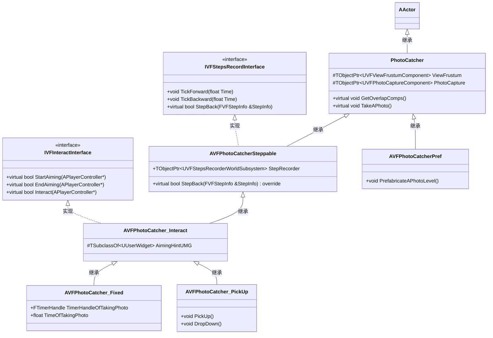
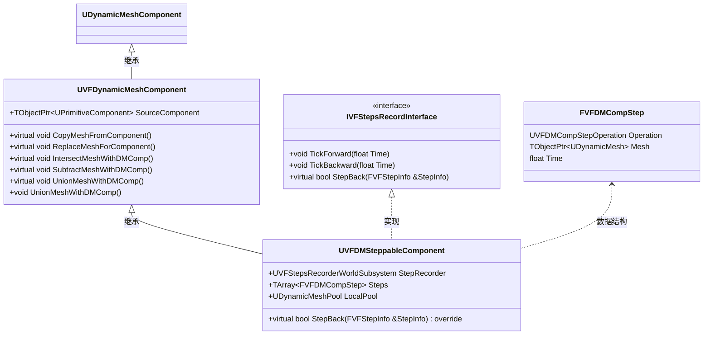
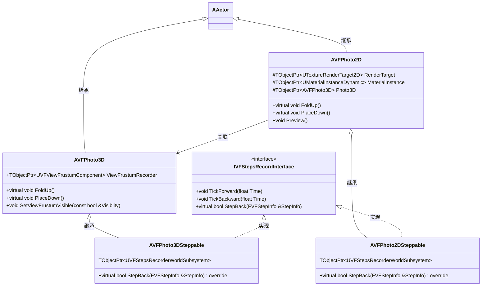
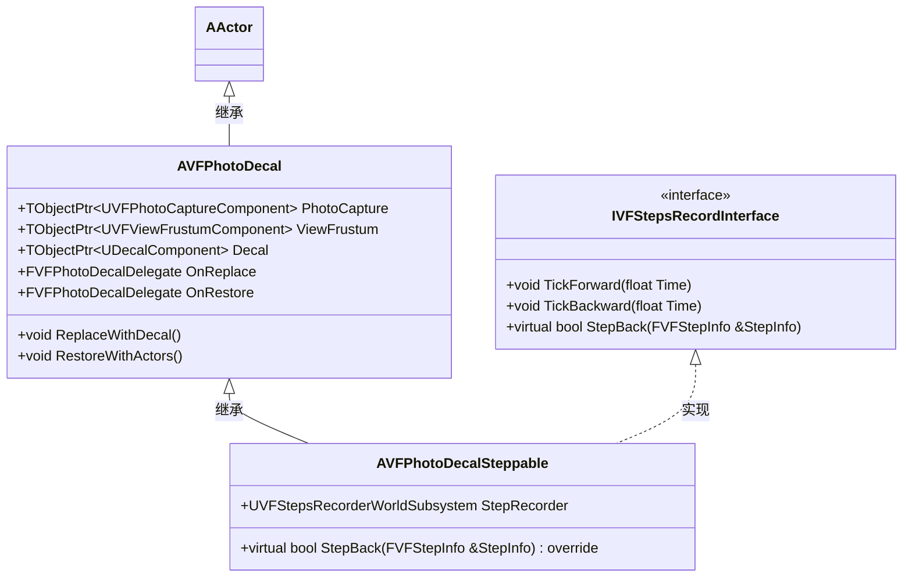
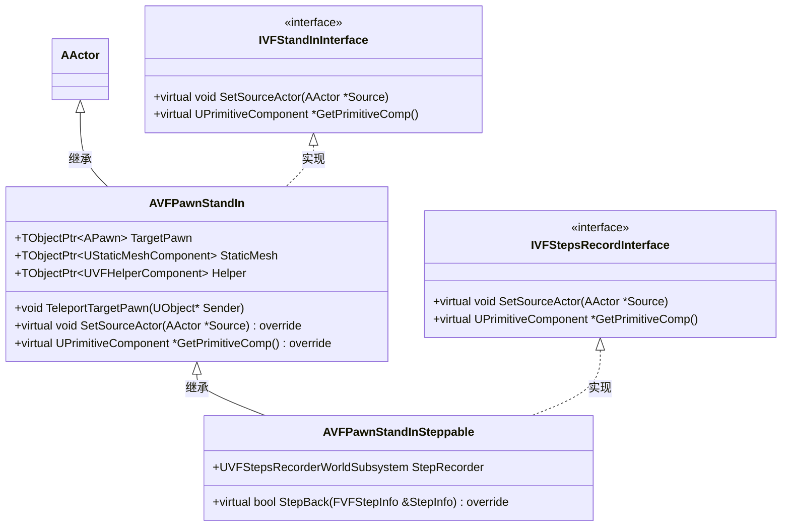
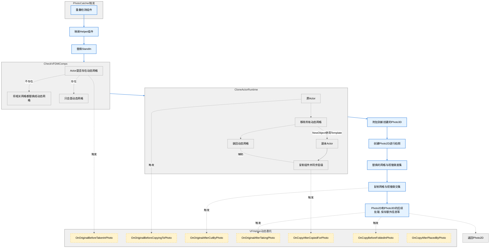
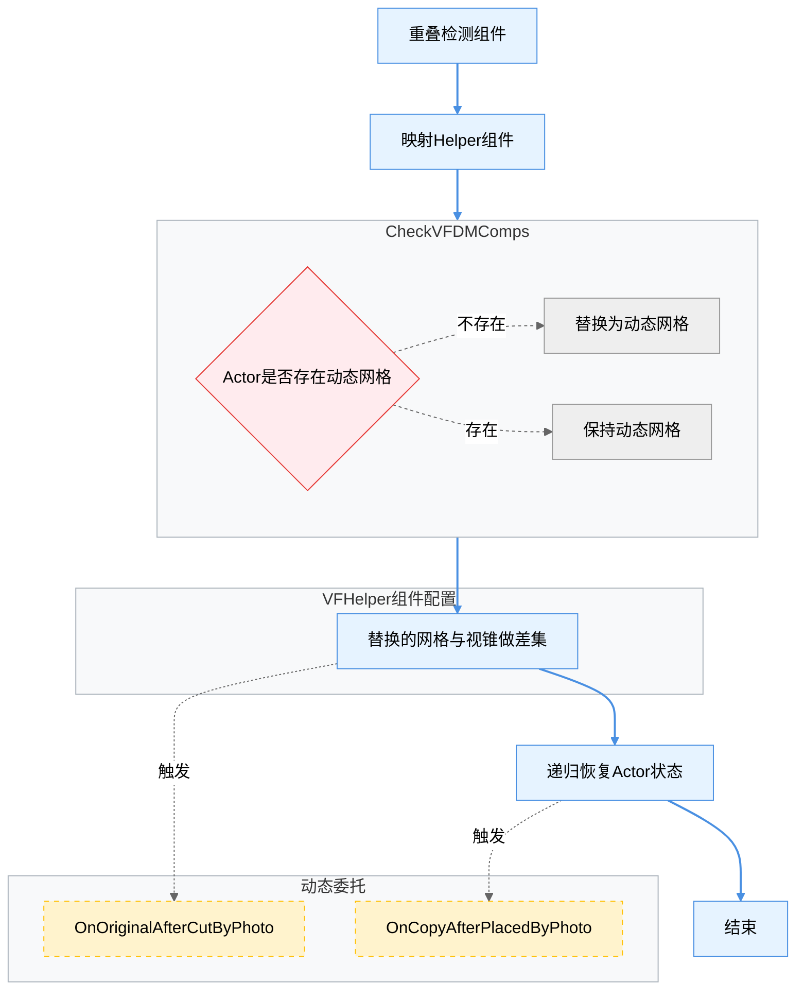

## 前置声明
`个人学习项目.无商业目的, 原则上也不允许商用(除非你得到了ViewFinder官方认可).开源协议: MPL2.0`

在虚幻引擎(5.3.2)中, 独立实现ViewFidner中**物体图案转换, 相机拍照, 照片覆盖, 时间回溯**的核心玩法, 并包装为**插件**.  
网格(动态网格体)切割实现, 基于官方插件[GeometryScripting](https://dev.epicgames.com/documentation/zh-cn/unreal-engine/geometry-scripting-users-guide-in-unreal-engine), 但已做了剥离, 可**独立使用**.  
**现不支持网络游戏**, 未实现色门相关机制.  
项目是个空壳, 内容已包装进插件, 蓝图资源也在插件中.两个模块: ViewFinderCore是核心代码逻辑, ViewFinderRe是用于交互和演示.  
80%+(大概?)的逻辑为C++, 蓝图使用较少, 阅读可能有难度, 最后面有类图和流程图；类都支持蓝图化, 几乎所有函数支持蓝图调用, 优化过使用逻辑, 使用难度低.

## 目录
- [特性一览](#-特性特性一览)
- [上手Demo](#-上手Demo)
- [代码框架](#-代码框架)

## 特性一览
- 拍照与放置  

  - 对场景中的静态网格体**无需做额外改动**, 即可使用相机相关功能.
  - VFHelper组件: 可**额外设置不可被拍入/不可被照片覆盖**; 使用**动态委托**, 可插入额外逻辑, (理论上)能够实现ViewFinder中全部的玩法.
  - 照片放置出来的物体, 遵循拍照前的模拟物理和开启重力, 无需手动管理.
  - 动态装卸的组件使用**对象池**, 组件内的动态网格体使用官方对象池.
  - 拍入本地的Pawn, (使用VFHelper和VFPawnStandIn), 放置会瞬移.
  - **视锥支持设置**: FOV, 宽高比, 近平面距离, 远平面距离.
  - 当前(或独立)场景预制照片, 可预制**递归照片**,.

- 物体图案转换  

  - 使用贴花组件改造, 自动支持正确的**近/远处缩放**.
  - ReplaceWithDecal()和RestoreWithActors(), (支持蓝图)可在运行时使用物体/贴花.
  - 预留动态委托触发.
  - 支持: 修改触发逻辑, 只替换部分物体, 当前(或独立)场景预制。

- 时间回溯  

  - 使用**世界子系统**, 只与接口类VFStepsRecordInterface进行交互.
  - 已有机制都已支持回溯, 支持快速回溯到关键事件.
  - 使用AVFTransfromRecorderActor和AVFTransformRecordVolume来**批量处理**只记录Transform的静态网格体, 支持带物理的Actor.
  - 要**自定义回溯逻辑**, 需继承IVFStepsRecordInterface接口, 有**两种实现路**(建议任选其一, 也可组合使用): 
    - 实现TickForward()**生成本地的Steps记录**.实现TickBackward()获得回溯的当前时间值, 用本地的Steps执行对应回溯操作.
      - 适合: 生成较多数据的, 强要求顺序的, 高频生成的.
      - 例子: AVFCharacter需要记录Transform和速度, AVFTransfromRecorderActor记录多个物体的Transform.
    - 在操作中, **向子系统SubmitStep**当前操作信息.实现StepBack(), 拿到子系统退回的操作信息进行对应回溯操作.
      - 适合: 简单的, 偶尔触发的, 瞬时性的.
      - 例子: AVFPhoto2DSteppable的FoldUp和PlaceDown操作.
    - 另外, 插件中自带的回溯, 全部是**增量**的. 实现思路是在TickForward()中进行差异判断, 只在数据变动后提交, 或者只提交变动数据.

## 上手Demo
### 流程介绍

### 搭建指南
#### 贴花场景, 迭代出现固定相机
提供了两种相机: BP_PhotoDecalSteppable_Hide, BP_PhotoDecalSteppable_Show
下面使用
#### 相机, 与物块, 地形, 照片的交互
#### 不可拍入的墙, 背后的可被裁切的物块
#### 委托打印物块

#### 预处理照片
Photo2D索引Photo3D, 所以最简单的做法就是把场景放置在Photo3D中.但这样场景是没有被裁切的, 
直接由相机在编辑器中, 对场景进行拍照, 然后生成Photo2D和Photo3D, 再将这俩作为场景实例就可以完美解决这个问题.
递归照片解决方案: Photo2D的Help中, 在被放置后复制外层Photo3D, 初始化为None并FlodUp, 即可解决.
#### 迭代照片

### 还未完全解决, 打勾是有暂时的处理办法
- [x] 贴花颜色无法与场景完全一致(AVFPhotoDecal).  
      - 已知问题为:   场景捕捉的本身就与玩家相机颜色存在偏差. 一个可能的解决方案: [插件CameraCapture](https://zhuanlan.zhihu.com/p/702941885).   

      更新:   
      1. 主因: 二次光照. 贴花映射的物体再进行了一次PBR流程, 导致颜色偏暗/亮. 同时光源的暖色和间接光(?)也因为二次关照, 导致颜色偏红/黄.
      2. 依据为: 调整场景主光源强度, 强度越高,贴花越亮; 强度越弱, 贴花越暗. 测试强度为3.7 lux时较为合适.
      3. 虽然能够设置光源的"不适用暖色"和ShowFlags不显示大气, 但似乎存在不可设置的间接光(不确定)依然导致偏色.
      4. 这样的办法, 在不同的距离下颜色也不协调, 但对于ViewFinder来说，它就应该是那个距离的光照.
- [X] 场景捕捉与虚拟阴影贴图不兼容. 在使用VSM时, 捕捉到的阴影会出现块状缺失.  
      项目已关闭VSM. [官方对此问题的描述](https://dev.epicgames.com/documentation/en-us/unreal-engine/virtual-shadow-maps-in-unreal-engine#scene-capture)
- [ ] 编辑器中查看组件属性, 会出现报错, 原因未知, 无影响, 忽略."LogOutputDevice: Error: Ensure condition failed: PropertyNodeMap.ParentProperty == CurObjectNode [File:D:\build\++UE5\Sync\Engine\Source\Editor\PropertyEditor\Private\DetailLayoutHelpers.cpp] [Line: 137]"
- [ ] 视锥偶尔碰撞检测不到物体, 换个角度/位置, 甚至重新来一次就行, 原因不确定. 天空盒缺失也是这个原因, 它没有被碰撞到, 没有被复制到照片, 放置出来便是空的. 猜测可能是球体被挖空后生成的碰撞有问题.  
      通过视锥分段(commit: [6423631](https://github.com/StrangeDS/ViewFinderRe/commit/6423631) [7794c81](https://github.com/StrangeDS/ViewFinderRe/commit/7794c81)), 已排除**三角面被过分拉长, 导致重叠检测失效**的可能.

      更新:   
      1. 天空盒的错误目前认为是在几次截取后, 剩余的部分凸包近似已经无法办到了, 导致生成的简单碰撞失效.
### 原游戏流程记录
0.1 板子坏, 时间回溯；照片出现传送门.  
0.2 电池, 电路板开启传送门；照片出现电池.物理抓手.  
0.3 旋转照片；照片中还可以有照片.  

第一章主场景.  
1.1.1 照片用于生成地形(距离、角度)、破坏地形.照片的大小.  
1.1.2 可破坏地形, 也可以破坏关键道具.  
1.1.3 0.3迭代版, 全景拍照投影.插入背景.  
1.1.4 多风格照片  

1.2.1 影印机获取电池.  
1.2.2 照片搭建地形.多照片组合地形.  

挑战关卡  
1.x.1 场景迭代.重力不同下的多照片地形组合.  

第二章主场景.  
2.1.1 透视图案的还原.可迭代.  
2.1.2 照片破坏地形, 透视图案的物体不应被破坏, 地形还要求能够到达透视图案的指定位置和旋转.  
2.1.3 开关；三原色组合图案.  
 
2.2.1 固定相机；拍摄制造地形、拉近传送门.  
2.2.2 固定相机；地形, 复制电池.  
2.2.3 两个固定相机；移动相机去拍摄、拉近传送门.  

2.3.1 图案/照片与物理电池的顺序逻辑解密.  
2.3.2 开关, 图案破坏, 固定相机, 电池的顺序逻辑解密.  

挑战关卡  
2.x.1 传送门处于照片物体背面, 3维旋转解密.  

第三章主场景  
3.1.1 开关三原色；获得相机, 复制电池.  

3.2.1 相机进阶使用；地形旋转.  
3.2.2 相机主动拉近传送门, 距离.  
3.2.3 主动拉近传送门, 地形.  
3.2.4 主动拉近传送门, 倒置.  
3.2.5 相机破坏地形, 复制电池.  

3.3.1 相机破坏地形, 旋转传送门.  
3.3.2 相机复制电池, 同时作为地形使用.  
3.3.3 相机复制电池, 同时旋转地形.  
3.3.4 需要相机远处, 角度, 拍下开关和传送门.  
3.3.5 同上, 要求更强.  
3.3.6 同上, 拍照角度需要自己去构建地形.  
3.3.7 同上, 但竖直方向.  

3.4.1 延时开关；破坏地形.  
3.4.2 延时节点；旋转地形.  
3.4.3 同上, 但触发需要自行制造地形.  
3.4.4 同上, 但拍照需要角度, 抢时间.  
3.4.5 同上, 但利用重力枪时间.  

3.5.1 实体变图案；地形变化.  
3.5.2 错误的图案映在正确的实体上；地形变化.  
3.5.3 错图正体；靠近变图案；实体重力掉出触发区域.  

第四章主场景  
4.1.1 不可被拍入且不可被覆盖.  
4.1.2 垫板凳；利用不可被覆盖, 只覆盖门；利用不可被拍照, 跨墙拍摄.  
4.1.3 利用不可被覆盖, 不覆盖地形.  

4.2.1 利用不可被覆盖, 跨墙放置物体.  
4.2.2 同上, 但把传送门放进去.  
4.2.3 利用不可被拍入, 跨墙拍传送门.  
4.2.4 同4.2.2.  

4.3.1 音源开关；三原色照片.  
4.3.2 照片移动音源.  
4.3.3 利用不可覆盖, 串联音源.  
4.3.4 延时音源串联；照片拉近距离.  
4.3.5 同4.3.2, 但用照片搬延时音源.  
4.3.6 三维旋转, 串联电路.  

4.x.1 胶卷也能复制；2指数幂的复制.  
4.x.2 制造地形, 但尽可能多和远.  
4.x.3 三维旋转, 但接住电池.  
4.x.4 资源管理.一张破门&复制电池；一张旋转地形&复制电池.  
4.x.5 (西瓜)重量开关；切西瓜.  

4.4.- 色门机制.  

第五章主场  
5.1.1 定时拍照；拍自己, 瞬移进不可覆盖的笼子.  
5.1.2 同上, 但进去开开关再出来.  
5.1.3 同上, 但还抓着电池.  
5.1.4 时机, 远距离瞬移自己.  
5.1.5 利用不可被拍入, 远距离瞬移自己.  

5.2.1 被裁切.  
5.2.2 剪切地形.  
5.2.3 剪切电池, 影印机复印.  
5.2.4 利用剪切, 同时拆墙和搭路.  

5.3.1 同时拍电池和自己.  
5.3.2 裁切会断路, 瞬移自己抢时间.  

5.4.1 最终关卡.  

## 代码框架
### 类图
#### PhotoCatcher相关, 最为复杂, 设计两层接口和功能衍生

#### 动态网格体相关, 拍照后网格体都会被用它来替代

#### Photo2D和Photo3D, 分别作为手中的照片和场景中的照片

#### PhotoDecal, 与其它的交互最少, 结构最清晰

#### PawnStandIn: 在Pawn被拍到时, 用之替换

---

### 核心流程
#### 拍照

#### Photo3D放置, 覆盖场景
