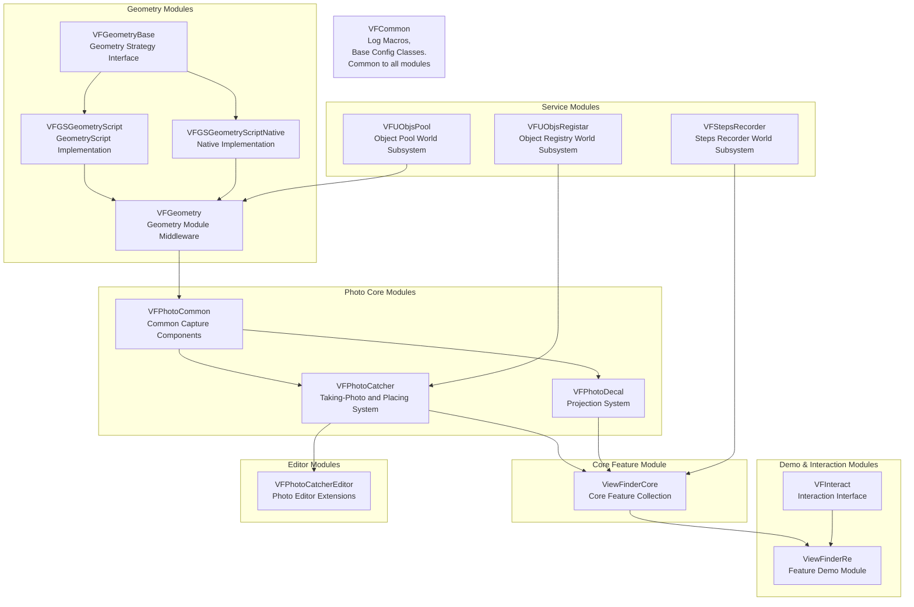
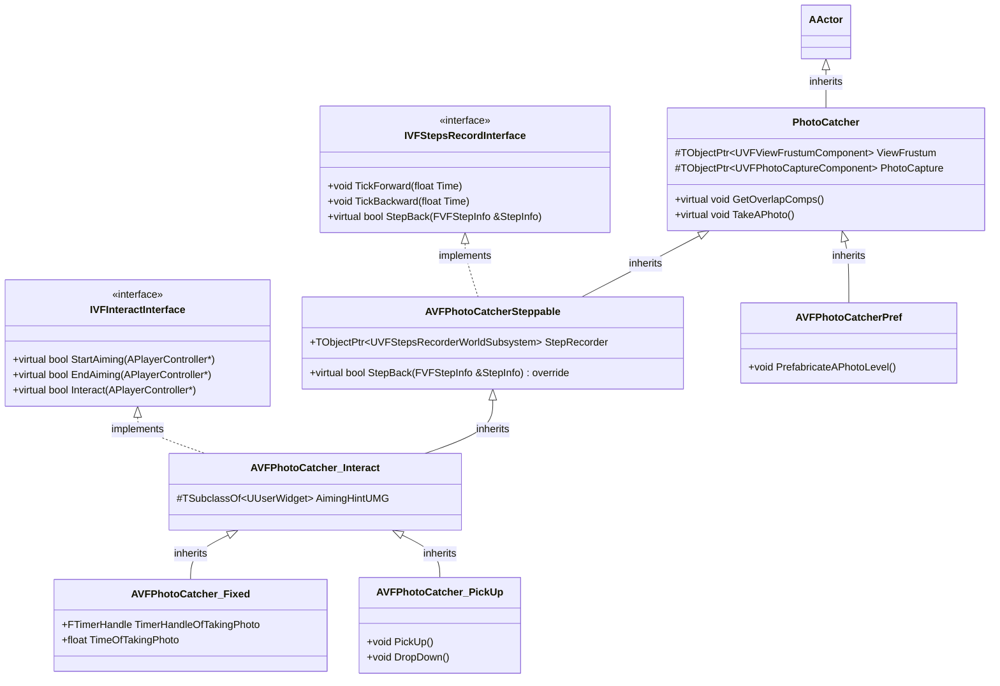
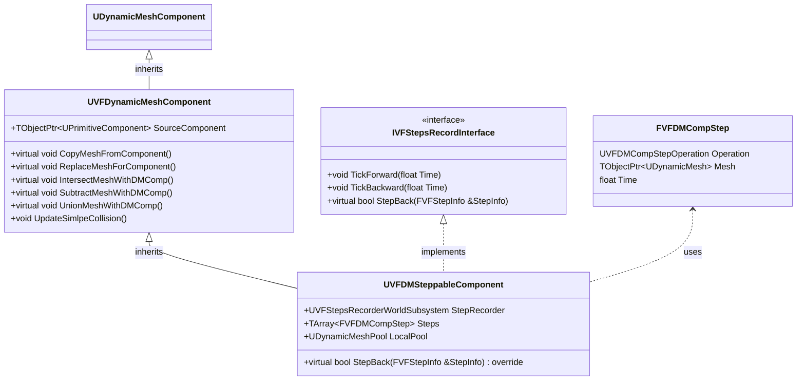
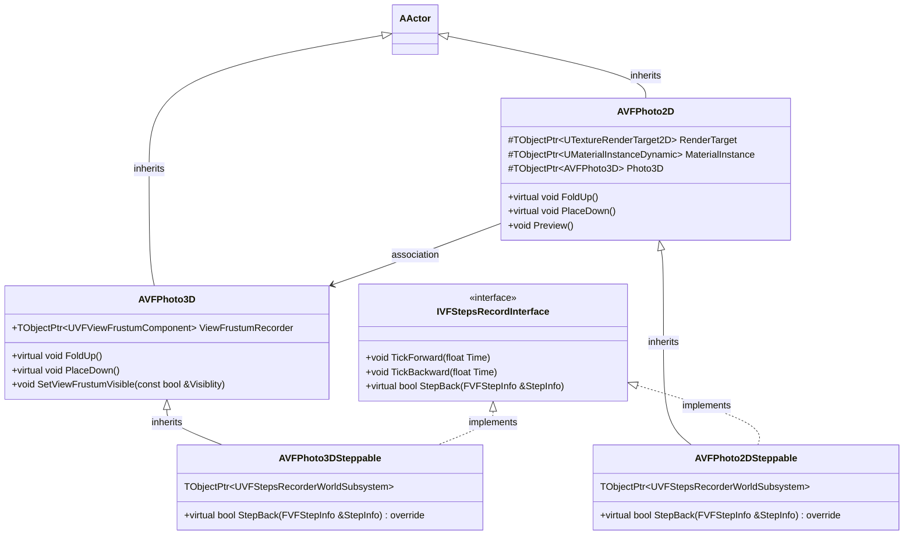
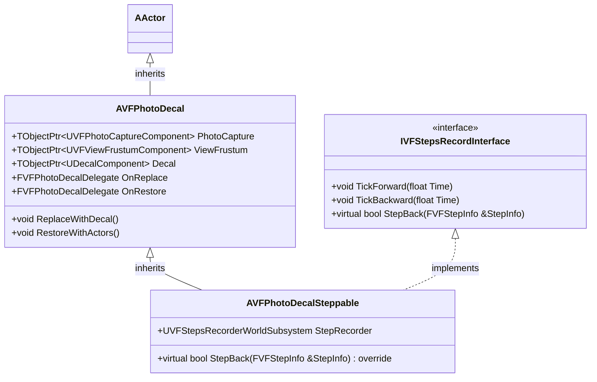
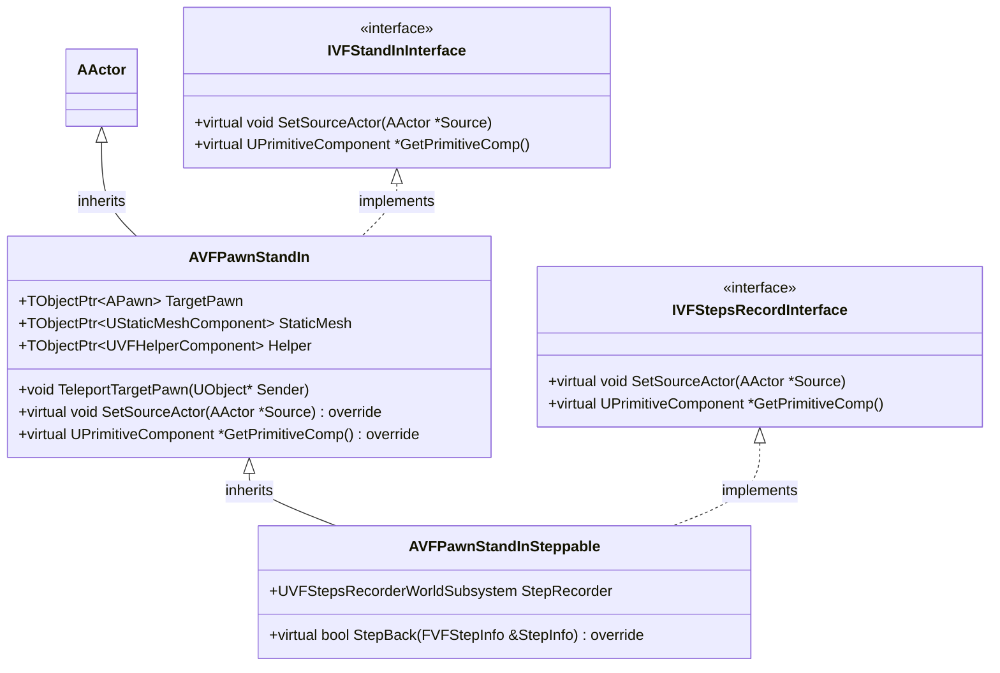
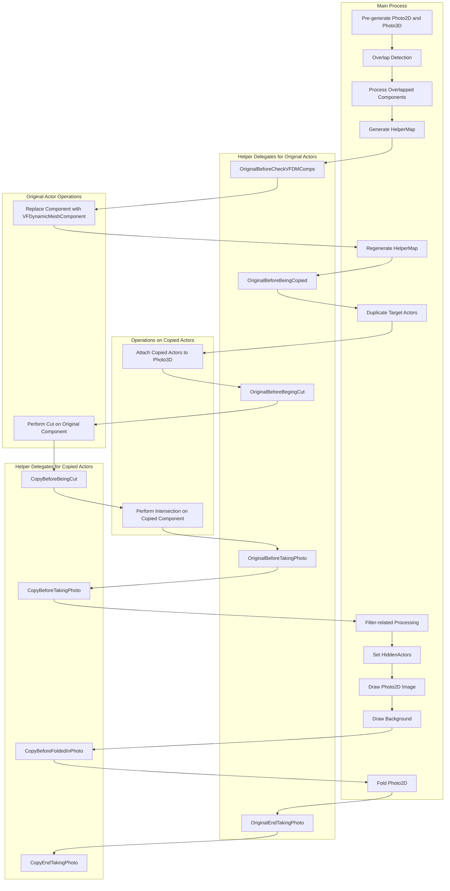
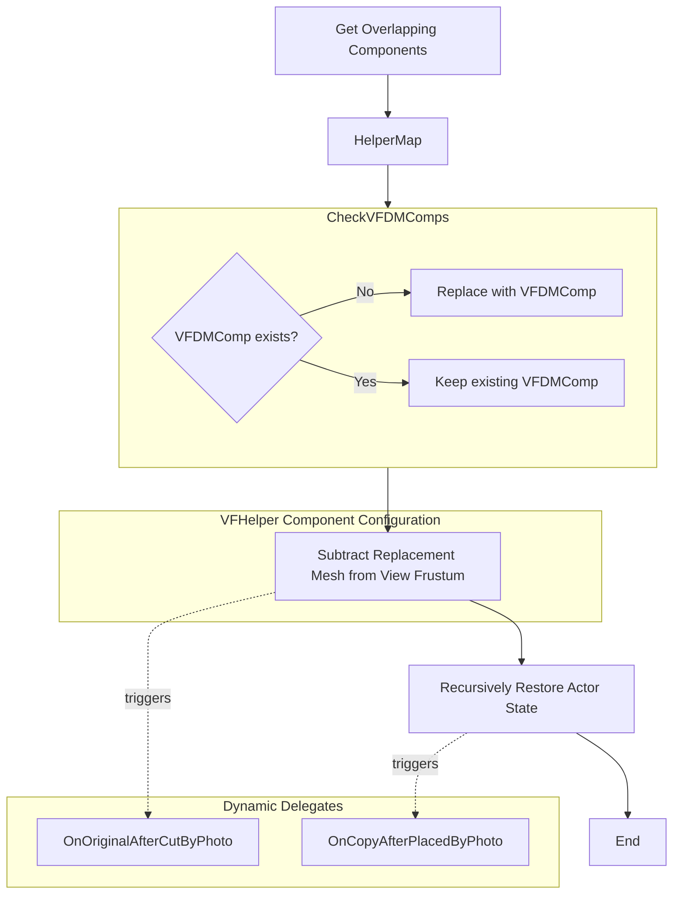
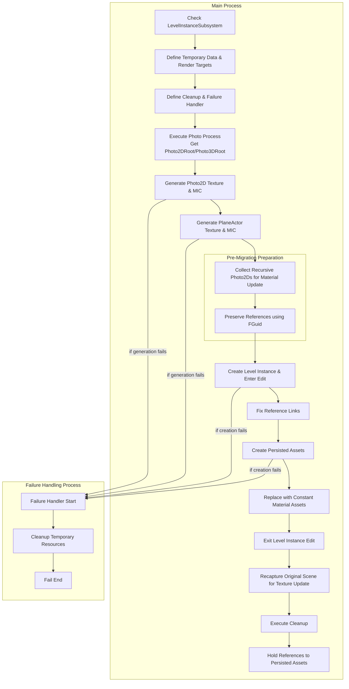

# :video_game: ViewFinderRe - Unreal Engine 5 Plugin

<a id="information_sourcepreface"></a>
## :information_source:Preface

**A learning project with no commercial intent, Kindly use for study only.**  
Respect to
[ViewFinder](https://img.shields.io/badge/ViewFinder制作组-SOSGames-Green.svg)
:sparkling_heart:

Developed with UE5.3.2 released.  
The project is empty, with all code and contents in the plugin.  
**Tested only on Windows. Standalone only.**  
Is Based on DynamicMeshComponent, with an optional dependency on the Plugin
[GeometryScript](https://img.shields.io/badge/Plugin-GeometryScript-Green.svg).  
Maintenance is volunteer-based and does not guarantee updates.

[](LICENSE)
[](https://space.bilibili.com/239325439)
[]()

:book: [**中文**](README.zh.md) | [**English**](README.md)  
Maintained in Chinese and translated into English with the assistance of AI.  

<a id="sparkles-features"></a>
## :sparkles: Features

<a id="video_game-reproduce-gameplay-mechanics"></a>
### :video_game: Reproduce gameplay mechanics
- **Photo ⇄ Object** - Take photo and place in runtime, prefabricated photo in editor.  
- **Projection ⇄ Object** - Basic and mesh-cut transformation.  
- **Time rewind system** - Supports all plugin mechanics.
- **Additional Functions** - Stand-in in photo, filtered photos, recursive placement, etc.

<a id="hammer_and_wrench-design-features"></a>
### :hammer_and_wrench: Design Features
- **Plug-and-Play** - Minimal setup requires only enabling "Enable CPU Access".
- **Low Intrusiveness** - DynamicMeshComponents are auto-managed, requiring no manual placement in scene.
- **Highly Configurable** - Supports for Blueprint assets and granular Project Settings (via DeveloperSettings).
- **Framework Design** - Incorporates component pooling, modular architecture, and interface decoupling.

<a id="dart-demo-content"></a>
### :dart: Demo Content
- **Demo Level(L_Demo)** - Showcasing the complete, hands-on experience with detailed commentary.
- **Full Time Rewind Support** - Rewind any moment and replay from there within the demo.
- **Walkthrough Video** - [To be Added]

<a id="warning-known-issues"></a>
### :warning: Known Issues
- **Relative Shadows not implemented**, currently uses default dynamic lighting.
- During Object-Projection transformation, **colors do not match completely**.
- DynamicMeshComponent **may fail to detect overlaps** rarely.
- No Landscape support. Only static meshes have been tested.
- For more details, see [FAQ](#faq) and [Unimplemented Mechanics](#unimplemented-mechanics)

<a id="rocket-rocket-for-different-audiences"></a>
### :rocket: For Different Audiences

**For Level/Gameplay Designers**
- All existing gameplay features are encapsulated with a low barrier to entry, including:
  - Blueprints at various functional levels, available for on-demand use
  - A wide range of configurable parameters are exposed, allowing for parameter adjustment without coding
- Can be extended via Blueprints to inject custom logic, which theoretically covers all three core gameplay mechanics of the ViewFinder
  - The filter gate feature has not been implemented; refer to the Unimplemented Hypotheses section for details regarding the filter gate[Implementation Speculation](#implementation-speculation)
- Built-in editor tools support cross-level pre-made photos and recursive photos

**For UE Learners**
- Fully open-sourced code, and ‌explanations for gameplay mechanics.
- Modular architecture, many design patterns practices.
- Detailed annotations and documentation explaining key design decisions.

**For Technical Developers**
- Extensible framework design, and interfaces/delegates provided in key processes, allowing for secondary development.
- Component-based non-intrusive architecture, a potential solution for "how to integrate into existing projects".
- Some technical solutions and lessons learned, and unimplemented technical hypotheses.

<details>
  <summary style="font-weight: bold; font-size: 1.3em;">
    &#x1F4CB;Table of Contents
  </summary>

- [:information\_source:Preface](#information_sourcepreface)
- [:sparkles: Features](#sparkles-features)
  - [:video\_game: Reproduce gameplay mechanics](#video_game-reproduce-gameplay-mechanics)
  - [:hammer\_and\_wrench: Design Features](#hammer_and_wrench-design-features)
  - [:dart: Demo Content](#dart-demo-content)
  - [:warning: Known Issues](#warning-known-issues)
  - [:rocket: For Different Audiences](#rocket-for-different-audiences)
- [Showcase](#showcase)
  - [:camera: Photo ⇄ Objects](#camera-photo--objects)
  - [:art: Projection ⇄ Objects](#art-projection--objects)
  - [:previous\_track\_button: Time Rewind](#previous_track_button-time-rewind)
- [Hands-On Experience](#hands-on-experience)
  - [*Get Started*](#get-started)
    - [Using the Plugin](#using-the-plugin)
    - [Try out the demo](#try-out-the-demo)
  - [*Glossary*](#glossary)
  - [*Working in the existing projects*](#working-in-the-existing-projects)
    - [Prerequisites](#prerequisites)
    - [Design Considerations](#design-considerations)
    - [Minimal Setup](#minimal-setup)
    - [Minimal Support (Least Impact)](#minimal-support-least-impact)
  - [*Configuring Photo-Taking Behavior \& Inserting Custom Logic*](#configuring-photo-taking-behavior--inserting-custom-logic)
  - [*Prefabricating A Photo*](#prefabricating-a-photo)
  - [*Projection-\>Object*](#projection-object)
  - [*Projection-\>Object*](#projection-object-1)
  - [*Configuration*](#configuration)
- [Advanced Usage](#advanced-usage)
  - [*Advanced Prefabrication of Photos*](#advanced-prefabrication-of-photos)
  - [*Using a Stand-In*](#using-a-stand-in)
  - [*Using the Time Rewinding System*](#using-the-time-rewinding-system)
  - [*Prefabricating a Recursive Photo*](#prefabricating-a-recursive-photo)
  - [*Prefabricating a Recursive Projection-\>Object*](#prefabricating-a-recursive-projection-object)
  - [*Completely Removing the `VFGSGeometryScript` Module*](#completely-removing-the-vfgsgeometryscript-module)
- [FAQ](#faq)
  - [*bAllowCPUAccess*](#ballowcpuaccess)
  - [*Projection Color Mismatch*](#projection-color-mismatch)
  - [*What Are Used From GeometryScript Plugin*](#what-are-used-from-geometryscript-plugin)
  - [*How to Integrate Custom Logic*](#how-to-integrate-custom-logic)
  - [*Disabling VSM*](#disabling-vsm)
  - [*No Level Streaming Implementation*](#no-level-streaming-implementation)
  - [*Overlap Detection Failures*](#overlap-detection-failures)
- [Technical Details](#technical-details)
  - [*Object-Projection Transformation*](#object-projection-transformation)
  - [*Dynamic Mesh*](#dynamic-mesh)
  - [*Dynamic Attachment/Detachment for the DynamicMeshComponent*](#dynamic-attachmentdetachment-for-the-dynamicmeshcomponent)
  - [*General Photo-Taking Process*](#general-photo-taking-process)
  - [*Defining Actor Behavior with the Helper Component*](#defining-actor-behavior-with-the-helper-component)
  - [*Prefabricating Photo Process*](#prefabricating-photo-process)
  - [*Time Rewinding Subsystem*](#time-rewinding-subsystem)
  - [*Rewind-compatible DynamicMeshComponent*](#rewind-compatible-dynamicmeshcomponent)
- [Other Technical Details](#other-technical-details)
  - [*Decal Perspective Projection*](#decal-perspective-projection)
  - [*VFTransformRecorderActor*](#vftransformrecorderactor)
  - [*Stand-In*](#stand-in)
  - [*Background Plane*](#background-plane)
  - [*Filter*](#filter)
  - [*PhotoContainer*](#photocontainer)
  - [*Interactable \& Activatable*](#interactable--activatable)
  - [*Plugin Dependencies and Their Handling*](#plugin-dependencies-and-their-handling)
  - [*Module Restructuring*](#module-restructuring)
  - [*FrustumGenerator*](#frustumgenerator)
- [Others](#others)
  - [*Module Diagram*](#module-diagram)
    - [Module Breakdown](#module-breakdown)
    - [VFCommon](#vfcommon)
    - [VFUObjsPool](#vfuobjspool)
    - [VFUObjsRegistar](#vfuobjsregistar)
    - [VFStepsRecorder](#vfstepsrecorder)
    - [VFGeometryBase](#vfgeometrybase)
    - [VFGSGeometryScript (Depends on VFGeometryBase)](#vfgsgeometryscript-depends-on-vfgeometrybase)
    - [VFGSGeometryScriptNative (Depends on VFGeometryBase)](#vfgsgeometryscriptnative-depends-on-vfgeometrybase)
    - [VFGeometry](#vfgeometry)
    - [VFPhotoCommon](#vfphotocommon)
    - [VFPhotoCatcher](#vfphotocatcher)
    - [VFPhotoCatcherEditor](#vfphotocatchereditor)
    - [VFPhotoDecal](#vfphotodecal)
    - [ViewFinderCore](#viewfindercore)
    - [VFInteract](#vfinteract)
    - [ViewFinderRe](#viewfinderre)
  - [*Class Diagram*](#class-diagram)
    - [PhotoCatcher Classes (Most Complex, featuring a two-layer interface and functional derivation)](#photocatcher-classes-most-complex-featuring-a-two-layer-interface-and-functional-derivation)
    - [DynamicMeshComponent Classes (Used to replace meshes during photo-taking)](#dynamicmeshcomponent-classes-used-to-replace-meshes-during-photo-taking)
    - [Photo2D and Photo3D Classes (Representing the held photo and the scene photo entity, respectively)](#photo2d-and-photo3d-classes-representing-the-held-photo-and-the-scene-photo-entity-respectively)
    - [PhotoDecal Classes (Minimal interaction with others, clearest structure)](#photodecal-classes-minimal-interaction-with-others-clearest-structure)
    - [PawnStandIn Classes (Replaces the Pawn when it is in photo-taking)](#pawnstandin-classes-replaces-the-pawn-when-it-is-in-photo-taking)
  - [Core Processes](#core-processes)
    - [Photo-taking Flowchart](#photo-taking-flowchart)
    - [Photo3D Placement (Cutting the Scene)](#photo3d-placement-cutting-the-scene)
    - [Prefabricating Photo Flowchart](#prefabricating-photo-flowchart)
  - [*Implementation Speculation*](#implementation-speculation)
  - [*ViewFinder Walkthrough*](#viewfinder-walkthrough)
  - [*Demo Walkthrough Design*](#demo-walkthrough-design)
  - [*Asset List*](#asset-list)
  - [*ToDoList*](#todolist)
</details>

## Showcase
Use GIFs for demonstrations with *Imgur* for image hosting.

<a id="camera-photo--objects"></a>
### :camera: Photo ⇄ Objects
|                                                                                                        |                                                                                                |
| :----------------------------------------------------------------------------------------------------: | :--------------------------------------------------------------------------------------------: |
|  |  |
|                             Take a photo of objects of simulating physics                              |                           Holds view frustum of different parameters                           |
|                |                          |
|                  Actors behave differently based on their helper(component)'s config.                  |                                      Cut rather than copy                                      |
|                            |              |
|                                             Filter effects                                             |                                        Recursive photos                                        |
|                                                                                                        |                                                                                                |

<a id="art-projection--objects"></a>
### :art: Projection ⇄ Objects
|                                                                                        |                                                                                        |
| :------------------------------------------------------------------------------------: | :------------------------------------------------------------------------------------: |
|  |  |
|                                 projection -> objects                                  |                                 objects -> Projection                                  |
|                                                                                        |                                                                                        |

<a id="previous_track_button-time-rewind"></a>
### :previous_track_button: Time Rewind
|                                                                              |                                                                                                            |
| :--------------------------------------------------------------------------: | :--------------------------------------------------------------------------------------------------------: |
|  |  |
|                            Time rewind for photos                            |                      Rewind the Object-Projection transformation and trigger it again                      |
|                                                                              |                                                                                                            |

## Hands-On Experience

### *Get Started*
You can [use the plugin](#using-the-plugin) and, after completing the [prerequisites](#prerequisites), [try out the demo map](#try-out-the-demo).
Alternatively, you can directly open the project to get started. It's a minimal project that contains only this plug-in.

#### Using the Plugin
1. Extract the plugin into `YourProject/Plugins/`. If the Plugins folder does not exist, create it manually.
2. Open your project. In the Plugins panel, search for `ViewFinderRe` and enable it.
3. Complete the [Prerequisites](#prerequisites).

#### Try out the demo
1. Open the demo map: `Plugins/ViewFinderRe/Content/Maps/L_Demo`
2. Click Play in Editor to run the demo. Explanations are provided in the scene. Have fun!

Working on getting this onto Fab...

### *Glossary*
This section defines project-specific terms and clarifies potential ambiguities.
- `PhotoCatcher`: The camera actor used for taking photos. Generates both a `Photo2D` and a `Photo3D` during `Photo-Taking Process`.
- `Photo2D`: The holdable photo that displays the captured image. It holds a reference to it's `Photo3D`.
- `Photo3D`: An actor that holds the view frustum and manages the entities(actors) within the photo.
- `PhotoDecal`: An actor uses a decal for the projection, and manages the replacement of entities(actors). It is the primary implementation for transformation between the projection and the objects.
- `ViewFrustum`: The view frustum volume, or specifically, its geometric shape.
- `Filter/Post process filter`: The `PhotoCatcher`'s post-process filter.
- `Projection`: Refers to the image representing an object, displayed using a decal. It functions more like a projection of an image onto a surface.
- `PlaneActor`: A planar Actor created by separately capturing background elements (e.g., the skybox) during `Photo-Taking Process`, which is then displayed as a distinct plane. For details, refer to [Background Plane](#background-plane).
- `StandIn`: An actor that temporarily replaces original actor during the photo-taking process.

### *Working in the existing projects*

#### Prerequisites
1. Open the editor
2. Ensure the ViewFrustum Object Channel exists. If not, create it and configure it as shown below:    

3. Ensure the ViewFrustum Collision Preset exists. If not, create it and configure it as shown below:  

4. Navigate to `ProjectSettings > Engine > Render`:
   1. Set `Shadow Map Method` to `ShadowMaps`
      1. `Note`: SceneCanpture2D conflicts with VSM. See [Disabling VSM](#disabling-vsm) for details.
      2. `Note`: This conflict was not observed in version 5.6.1.
   2. Set `Custom Depth-Stencil Pass` to `EnabledWithStencil`
      1. If not, the post process filters will not work correctly.
5. Navigate to `ProjectSettings > ViewFinderRe > VFGeometryDeveloperSettings` and set `GeometryStrategyClass` to `GeometryStrategyClass改为VFGSGeometryScriptNative`
6. Restart the editor

#### Design Considerations
`For Simplicity`: Ideally, the plugin would work out-of-the-box in any scene, treating all actors equally and allowing any of them to be taken photos.  
`For Project Control`: In practice, it's often better to limit the functionality. Restricting which actors are affected is usually more desirable.  
`Technical Reality`: Currently, the plugin is tested and implemented for Static Meshes. Support for many other mesh types remains unknown.  
These considerations lead to two different solution/Usage approaches:  

#### Minimal Setup
1. Open an existing map, or create a New Level of Basic.
2. Change the default GameMode to `BP_VF_GameMode`.
3. Find the Blueprint `BP_PhotoCatcher_PickUp` in the Content Browser and drag it into the scene.
4. Run the game. Pick up the `PhotoCatcher`, take a photo, and place it.

You may have triggered a breakpoint (Mesh Xxx bAllowCPUAccess needs to be true). Please refer to [bAllowCPUAccess](#ballowcpuaccess).

#### Minimal Support (Least Impact)
If you try creating a `New Level > Open World`, you will encounter an error because terrain is not supported.
We will use this situation as an example to set up support for specific Actors only:
1. Open an existing `Open World` map, or create a `New Level > Open World`.
2. Override the default GameMode with `BP_VF_GameMode`.
3. Find the Blueprint `BP_PhotoCatcher_PickUp` and drag it into the scene.
   1. Check the `Only Overlap with Helper` option in its Details panel.
   2. (Optional) Uncheck the `Generate APlane Actor` option.
4. Find the Blueprint `BP_PhysicsCube_WithHelper` and drag it into the scene.
5. (Optional) Add any other Actor, for example a `Shape > Cylinder`.
      1. Add a `VFHelper` component to it. No configuration changes are needed.
      2. In `Project Settings > ViewFinderRe > VFPhotoCommonDeveloperSettings`, change the `Helper Getting` option to `By Get Component by Class`.
6. Run the game. Pick up the `PhotoCatcher`, take a photo, and place the photo.

You should implement your own interaction logic. The provided GameMode is for demonstration and testing purposes only, and includes the following class overrides:
1. `BP_VF_HUD`: A simple HUD that displays the current time.
2. `BP_VF_PlayerController`: Handles input for time rewinding.
3. `BP_VF_Character`: Manages input response, line traces (for interactable objects), and more.

### *Configuring Photo-Taking Behavior & Inserting Custom Logic*
This section demonstrates an alternative method for getting the Helper component.
1. In `Project Settings > ViewFinderRe > VFPhotoCommonDeveloperSettings`, set `Helper Getting` to `By VFHelper Interface`.
2. Create an Actor Blueprint. Inside, create and attach a `Static Mesh Component`, setting its `Static Mesh` to `SM_ChamferCube`.
3. Add a `VFHelper` component.
   1. Set its `Show in Photo Rule` to `Neither`.
   2. (Optional) Uncheck `Can be Placed by Photo`.
4. In the `VFHelper` component's Event Graph, add the `On Original End Taking Photo` event and connect a `Print String` node to output your custom debug message.
5. Make the Actor implement the `VFHelperInterface`. Override the `Get Helper` function and return the `VFHelper` component.
6. Place this Actor in the scene for testing. It will print the message during photo-taking, but will not appear in the `Photo2D`. (Optionally, it will not be overridden by `Photo3D`).

For the purpose and execution order of the `VFHelper`'s dynamic multicast events, please refer to [General Photo-Taking Process](#general-photo-taking-process) and [Defining Actor Behavior with the Helper Component](#defining-actor-behavior-with-the-helper-component).

### *Prefabricating A Photo*
1. Create a new level (do not use World Partition) and set up your desired scene.
2. Place a `BP_PhotoCatcherPref` actor.
   1. Right-click it and select Pilot to navigate to your desired position.
   2. Right-click the light green view frustum and `Stop Piloting`.
3. Open the Details panel for the `BP_PhotoCatcherPref` instance and configure its settings.
   1. Adjust parameters, such as the `View Angle` to the view frustum, `Only Overlap with Helper`, `Object Types to Overlap`, etc.
   2. When the `Only Actors Catched` array contains data, it will only process those actors.
   3. Use the `Actors to Ignore` array to exclude specific actors.
4. In the Details panel, click the `Prefabricate A Photo Level` button (a CallInEditor function) to generate the "_Photo" level.
   1. Choose a path to save the new level. It's recommended to save it at the same directory level as the current level and add the `_Photo` suffix.
   2. Ignore and confirm the subsequent warning: `Actor BP_Photo3DSteppable is referenced by other Actors/objects. Do you really want to delete it? This will break references.`
   3. In the selected path, besides the new level, two textures and two material instances will be generated. These are the texture and material instance for the photo itself, and the texture and material instance for the background image.
5. The `_Photo` level is a prefabricated photo. You can place it in other levels where it will exist as a photo.
6. Important: When deleting, first delete the generated texture and material instance assets, then delete the `_Photo` map.
   1. Failure to follow this order may cause the editor to crash. The cause is unknown, but it is suspected to be a circular reference issue.

### *Projection->Object*
1. Set up your scene.
2. Place a `BP_PhotoDecalSteppable_Show` actor and use `Pilot` to position it correctly.
   1. Adjust the view frustum's Far Plane. An excessively distant plane is unnecessary; a closer plane improves performance.
   2. Add the actors you want to convert into the projection to the `Managed Actors` array.
   3. Check `Only Catch Managed Actors` as needed.
      1. When enabled, the scene capture will use `PRM_UseShowOnlyList` and ignore all other actors.
      2. Note: Enabling this will also prevent capturing shadows from other actors.
3. Select the actor and switch to its Decal component in the Details panel. Using the local coordinate system and moving only along the **positive X-axis**, position it where the projection should appear.
   1. Do not adjust the decal's scale directly, as it is controlled by `AVFPhotoDecal::OnConstruction`.
      1. You can adjust the `Decal Size`, but a standard cube ratio is recommended.
   2. Adjust the `Target Width` and `Target Height` of the CaptureOfDecal component:
      1. These properties lock the camera's aspect ratio. Modifying them will automatically adjust the camera's Field of View.
      2. They affect the final quality of the projection.
4. The position of the `DetectionArea` component typically does not need moving. It is used for comparison with the player camera's position and orientation.
5. In the Level Blueprint, get a reference to this actor and manually call its `ReplaceWithDecal` function.
   1. Note: Lighting might appear incorrect in the editor, but it will be correct in the packaged build.
   2. To ensure correct lighting in the editor, you can use a Delay node (e.g., 0.2 seconds) before calling the function.
6.  If `Keep First Replacement` is checked, time rewinding will not revert the operation of being replaced with a projection for the first time.

### *Projection->Object*
1. Set up your scene.
2. Place a `BP_PhotoDecalSteppable_Show` actor and use `Pilot` to position it correctly.
   1. Adjust the view frustum's Far Plane. An excessively distant plane is unnecessary; a closer plane improves performance.
   2. Add the actors you want to convert into the projection to the `Managed Actors` array.
   3. Check `Only Catch Managed Actors` as needed.
      1. When enabled, the scene capture will use `PRM_UseShowOnlyList` and ignore all other actors.
      2. Note: Enabling this will also prevent capturing shadows from other actors.
3. Select the actor and switch to its Decal component in the Details panel. Using the local coordinate system and moving only along the **positive X-axis**, position it where the projection should appear.
   1. Do not adjust the decal's scale directly, as it is controlled by `AVFPhotoDecal::OnConstruction`.
      1. You can adjust the `Decal Size`, but a standard cube ratio is recommended.
   2. Adjust the `Target Width` and `Target Height` of the CaptureOfDecal component:
      1. These properties lock the camera's aspect ratio. Modifying them will automatically adjust the camera's Field of View.
      2. They affect the final quality of the projection.
4. Position and scale the `DetectionArea` component. This defines the volume that triggers the hiding of the managed actors.

### *Configuration*
1. Many properties are exposed as configurable in the Blueprints. You can find them under the `ViewFinder` category, or filter by the `ViewFinderRe` property section.
2. Additional configuration options are available under Project `Settings > ViewFinderRe`.

## Advanced Usage

### *Advanced Prefabrication of Photos*
For plugin users, prefabricating a photo often involves multiple iterations: sometimes requiring re-Prefabricating, while other times only updating the photo's image.  
For plugin maintainers, prefabrication is entirely an in-editor process, and the underlying code is inherently complex. Handling special cases, such as converting a `Photo2D` into a recursive photo, and accounting for potential future specialized classes, can make maintenance particularly challenging.  

The following outlines the Prefabricating process, ordered from least to most flexible:
- For `generic scene content`, no special handling is typically required. It will be properly segmented into the new scene. 
- For a `Blueprint class with a Helper component`, its dynamic multicast events are bound by default and will execute in the editor world. However, you may need to consider save and initialization order.
- For an `Actor with a Helper component that binds its multicast events in BeginPlay`:
  1. In the editor world, the multicast events are not bound, so the corresponding logic will not run.
  2. Manually execute its intended logic within the `_Photo` level. It is recommended to use a `CallInEditor` function for this.
  3. (Optional) On the DynamicMeshComponent (under the Static Mesh Component), click RestoreSourceComponentInEditor to destroy the replacement by this dynamic mesh.
     1. This is useful for Actors that process the original mesh, but note: this will disable mesh slicing.
     2. Alternatively, some Actors might detect the DynamicMeshComponent in BeginPlay for special handling.
- For any arbitrary Actor:
  1. After generating the `_Photo` level, place the Actor under the Photo3D hierarchy in the new scene.
  2. Also place an identical copy at the corresponding location in the original level.
  3. In the Details panel of the original `BP_PhotoCatcherPref` camera, click the `UpdateMIC` button.
  4. Consider using the `ActorPalette` plugin to synchronize positions.

### *Using a Stand-In*
First, a basic example to make any Actor use a Stand-In when photographed:
1. Add a `Helper` component and configure it:
   1. Set `bReplacedWithStandIn` to `true`.
   2. Set `StandInClass` to `BP_CubeStandIn`.

The following explains how to create a Stand-In Actor. Please refer to `BP_CubeStandIn` as an example.
1. Create an Actor and implement the `VFStandInInterface`.
2. Override the `GetPrimitiveComp` function to return the Primitive Component (e.g., Static Mesh) you want to represent the original Actor in the photo.
3. Add a `Helper` component and configure it to define the Stand-In's behavior during the photo-taking process.

Important notes regarding `IVFStandInInterface::GetOriginalActor`:
- In C++-based classes (e.g., `BP_PawnStandInSteppable`), it works correctly, and you can use this function to get a reference to the original Actor.
- In pure Blueprint classes (e.g., `BP_CubeStandIn`), it does not work as expected. You must create a Blueprint variable to manually store a reference to the original Actor, as demonstrated in `BP_CubeStandIn`.
- The root cause for this inconsistency is currently undetermined.

### *Using the Time Rewinding System*
This section introduces two primary methods of use.

To record data such as an Actor's Transform (hereafter referred to as Data):
1. Have your Actor implement the `VFStepsRecorderInterface`.
2. Override the `TickForward` function.
   1. Maintain a local array of your Data structure.
   2. Each tick, compare the current state with the last entry in the array. If different, append a new copy of the current Data to the end.
3. Override the `TickBackward` function.
   1. Its invocation indicates that rewinding is in progress.
   2. Based on the Data array, calculate and apply the Transform (or other data) that the Actor should have for the current rewind frame.
4. In `BeginPlay`, or whenever the Actor should start being processed, register it with the rewinding system using `RegisterTickable`.
5. Upon destruction, or when it should stop being processed, unregister it using `UnregisterTickable`.

Example using a `PhotoCatcher` (as in `AVFPhotoCatcherSteppable`):
1. The `PhotoCatcher` implements the `VFStepsRecorderInterface`.
2. After taking a photo, it creates an `FVFStepInfo` instance, marks it as a keyframe, and submits it to the rewinding system via `SubmitStep`.
3. It overrides the `StepBack` function. When the rewinding reaches this keyframe, the corresponding reverse operation is performed.
   1. You might notice that no direct action happens here.
   2. The destruction of the `Photo2D` and `Photo3D` is handled by the objects themselves—they are destroyed when rewinding reaches their creation point.
   3. This reflects a design philosophy of self-management, offering greater freedom and avoiding overly intertwined logic.
   4. Because both `Photo2D` and `Photo3D` manage themselves, the act of "rewinding to the previous keyframe" is effectively initiated by the `PhotoCatcher`.

For a more detailed explanation, you can also refer to [Time Rewinding Subsystem](#time-rewinding-subsystem).
- `VFStepsRecorderWorldSubsystem` also provides:
  - A unified, pre-allocated array size.
  - `RecordTransform` and `UnrecordTransform` functions, simplifying the use of `AVFTransformRecorderActor`
  - `StartRewinding` and `EndRewinding` dynamic multicast events.
  - Functions like `SetTimeOfStart` and `SetTimeOfEnd` for potential future extensions (e.g., manually setting rewind start/end points).
    - Initially added to solve issues when rewinding to `TIME_MIN` would destroy actors in streaming levels.
    - Kept as the concept of a bounded rewind window could be a useful gameplay mechanic.
  - The `DECLARE_STEPSRECORDER_SUBSYSTEM_ACCESSOR` macro, which simplifies subsystem accessor declaration and usage.

### *Prefabricating a Recursive Photo*
1. Set up your scene.
2. Place the `BP_Photo2DSteppable` Blueprint in the scene and **check the bIs`Recursive property**.
3. Position the Pref camera (`BP_PhotoCatcherPref`) at your desired location and angle.
4. Click the button to call the `PrefabricateAPhotoLevel` function.
5. Click the `UpdateMIC` button on the Pref camera multiple times to iteratively update the recursive effect of the photo's image until you are satisfied.

Simpler than expected, right? The specific implementation is explained in the [Prefabricating Photo Process](#prefabricating-photo-process).

### *Prefabricating a Recursive Projection->Object*
This process is more complex. Using `L_A7` as an example:
1. Create the base scene `L_A7_Base` and identify the recursive section.
2. Use the Pref camera to take a photo. Configure `ActorsToIgnore` to capture **only the recursive Objects**, generating the new level `L_A7_Recursive_Start`.
3. Duplicate `L_A7_Base` as `L_A7`, and replace the recursive section with the content from `L_A7_Recursive_Start`.
4. Place and configure a `BP_PhotoDecalSteppable_Recursive` actor, setting its `ManagedActors`.
   1. This actor will manually destroy the `ManagedActors` in its `OnDestroy` event.`
5. In the Level Blueprint of `L_A7_Recursive_Start`:
   1. Get a reference to the `BP_PhotoDecalSteppable_Recursive` actor. Implement logic to spawn a new level instance and store a reference to it.
   2. Use a `Delay` node before calling `ReplaceWithDecal` on the `BP_PhotoDecalSteppable_Recursive` actor to ensure correct lighting in the editor.
   3. Implement the `VFStepsRecorderInterface`. Override the `StepBack` function to unload the reference to the new level instance.
6. Duplicate `L_A7_Recursive_Start` as `L_A7_Recursive`.
   1. The content is largely identical, except it loads the new level instance immediately (without the `Delay` node).
7. In theory, simply unloading the level instance correctly should suffice. However, in practice, the Time Rewinding subsystem maintains hard references that prevent proper unloading. Therefore, the `BP_PhotoDecalSteppable_Recursive` actor must manually call `Destroy` actors.

### *Completely Removing the `VFGSGeometryScript` Module*
1. Ensure the current `Project Settings > ViewFinderRe > VFGeometryDeveloperSettings > GeometryStrategyClass` is **not** set to `VFGSGeometryScript`.
2. Disable the `GeometryScript` Plugin.
3. If your goal is only to remove the `GeometryScript` plugin dependency, you can stop here. The `VFGSGeometryScript` module will not be enabled automatically.
4. Modify `ViewFinderRe.uplugin` and remove the module description for `VFGSGeometryScript`.
5. (Optional) Modify `FVFGeometryBaseModule::StartupModule()` and remove the code responsible for loading the `VFGSGeometryScript` module.
6. If errors occur, you can modify `DefaultViewFinderReSettings.ini` by deleting the `GeometryStrategyClass` configuration, which will fall back to using `VFGSNone`.

## FAQ

### *bAllowCPUAccess*
`UStaticMesh::bAllowCPUAccess` - Official description:  
```
- If true, will keep geometry data CPU-accessible in cooked builds, rather than uploading to GPU memory and releasing it from CPU memory
- This is required if you wish to access StaticMesh geometry data on the CPU at runtime in cooked builds (e.g. to convert StaticMesh to ProceduralMeshComponent)
```

**Static Meshes used for Boolean operations must have this property enabled**. This is verified internally by an `ensure` check.  
If this property is disabled, the Boolean operations might appear to work correctly in the Editor. However, in a packaged build, the geometry data becomes inaccessible, causing the operations to fail.  

### *Projection Color Mismatch*
The color of the `Projection` from a `PhotoDecal` cannot perfectly match the scene, primarily for two reasons:

*The scene capture inherently produces color deviations compared to the player camera*. The closest matching settings are:
- In the Post Process Volume, set `Global Illumination` to `Lumen`.
- In the Post Process Volume, set `Reflections` to `Lumen`.
- Disable `Atmosphere` in `ShowFlags`.
- A potential solution is the [CameraCapture Plugin](https://github.com/nofairy/UE_CameraCapture_Plugin).  

The issue is compounded by what could be called "*dual lighting passes*":
1. Objects captured by the scene capture undergo one lighting calculation to become the decal's projection texture.
2. This projection is then applied via the decal and undergoes a second lighting calculation before reaching the player's view.

Attempts to Eliminate One Lighting Pass:
- For the first pass, adjusting `ShowFlags` can capture the base color before lighting, but the resulting image lacks shadows. Furthermore, it would then use the lighting at the decal's placement location, rather than the original object's location.
- For the second pass, decals cannot change their shading model to use **Emissive** to skip the lighting calculation.

No perfect solution has been found. The current outcome is:
- The decal appears too bright in well-lit areas and too dark in poorly lit areas.
- Use `UVFPhotoDecalDeveloperSettings::PhotoDecalLightFix` to apply a simple color correction, which attempts to counteract one lighting pass based on the current color value.
- A potential solution might be to customize the decal's blending timing, mixing it into the scene after the main lighting pass.

### *What Are Used From GeometryScript Plugin*
- Refer to the `IVFGeometryStrategyInterface`. This is the abstract strategy interface that defines the utilized functionalities.
- Refer to the `UVFGSGeometryScript` class. This is the concrete strategy class where the GeometryScript plugin is specifically called to implement these functionalities.

### *How to Integrate Custom Logic*
- Use the `Helper` component, which provides several dynamic multicast events. Understanding the [General Photo-Taking Process](#general-photo-taking-process) is essential to grasp the purpose and execution order of these delegates. 
- The Projection ⇄ Object transformation process also provides dynamic multicast events for customization.  
- The [Advanced Usage](#advanced-usage) section explains numerous extensions, including the use of Stand-Ins and how to extend the Time Rewinding System.

### *Disabling VSM*
Virtual Shadow Maps (VSM) need be disabled.  
Scene Capture is incompatible with Virtual Shadow Maps. When VSM is enabled, captured shadows may exhibit blocky artifacts or missing parts.  
VSM is disabled by default in this project. [Official documentation regarding this issue](https://dev.epicgames.com/documentation/en-us/unreal-engine/virtual-shadow-maps-in-unreal-engine#scene-capture).  
However, in version 5.6.1, no issues were observed during testing, although no official announcement confirming a fix has been found.

### *No Level Streaming Implementation*
A ViewFinder-specific level streaming system was not implemented. For details, see [Unimplemented Speculation](#unimplemented-speculation).

### *Overlap Detection Failures*
The view frustum occasionally fails to detect overlapping objects. Changing the angle/position, or simply retrying, often resolves the issue. The root cause remains undetermined.  
Through view frustum segmentation (commits: [6423631](https://github.com/StrangeDS/ViewFinderRe/commit/6423631), [7794c81](https://github.com/StrangeDS/ViewFinderRe/commit/7794c81)), the possibility of **overlap detection failing due to excessively elongated triangles** has been ruled out.  
The cause might lie within the physics engine's low-level system. Practical tests show that when an elongated object overlaps another and passes through two faces without overlapping any edges, overlap detection can fail.  

## Technical Details
This section contains no code, focusing instead on design considerations and implementation approaches.  
We attempt to follow the STAR structure, though as this hasn't been formally standardized, it may differ from your expectations.  
My personal interpretation is: S describes the observable phenomenon, T breaks it down into technical tasks, A details the concrete implementation, and R evaluates the outcome. 
Only the more core technical details are listed here; others can be found in [Other Technical Details](#other-technical-details).  

### *Object-Projection Transformation*
This mechanism is relatively simple and has fewer dependencies, so it is presented first.  

- Situation (S):  
Examples from ViewFinder: Projections of certain objects revert to their original form when viewed from specific angles; objects in the scene transform into projections based on various triggers (collision volumes, sequence); a projection can expand into an entire scene when viewed from a particular angle.
- Task (T):  
Provide core functionality: Generate projections; manage mutual exclusivity between projections and objects; include dynamic multicast events for extensibility.  
Derived classes handle specific behaviors. Triggers could be Actors or components for ease of use.
- Action (A): 
  - Object -> Projection: Clearly requires a Scene Capture to obtain the image, then applied as a material parameter.
  - Projection: Must adhere to various surfaces and angles – this aligns with the behavior of a Decal.
  - Objects need definable capture bounds, achievable via the Scene Capture's
  - Decal Modification: The decal needed customization to achieve perspective correction (distant objects appear smaller) and to only appear on the first hit surface. For details, see [Decal Perspective Projection](#decal-perspective-projection).
  - Projection → Object: Also requires a similar capture process, but instead of displaying the decal, the original object is revealed or managed.
- Result (R):  
1. The base class `AVFPhotoDecal` provides core Projection ⇄ Object functionality.
     - `bOnlyCatchManagedActors` controls the `PrimitiveRenderMode`.
     - Includes a visual View Frustum for spatial awareness and future potential for scene destruction.
2. Derived class `BP_PhotoDecalSteppable_Hide`: Triggers Object -> Projection at specific locations.
    - Uses a collision volume to trigger the transformation.
    - Reverts the change upon exiting the volume, facilitating testing.
    - Permanent changes should use Actor collision.
3. Derived class `BP_PhotoDecalSteppable_Show`: Automatically performs Object -> Projection, conditionally triggers Projection -> Object.
    - Uses a collision volume checking the player camera's Transform (with tolerance) as the trigger.
    - Configurable option to slice the current scene using the View Frustum.
    - Includes a simple function to correct the object's Transform.


### *Dynamic Mesh*
Now let's consider the implementation of the photo-taking functionality.  
- Situation (S):  
A camera takes a photo of the scene. The resulting `Photo2D` can be placed in the world, and the objects within it are restored as physics-enabled entities in the scene.  
- Task (T):  
An intuitive solution is to use Scene Capture to obtain an image, which is linked to a hidden set of objects. When the photo is placed, this hidden object group becomes visible.  
The meshes require real-time Boolean operations and the ability to compute collisions dynamically.  
The system must automatically support Actors/Components that simulate physics.  
- Action (A):  
A decision was needed regarding the runtime mesh representation. The candidates were `ProceduralMeshComponent`, `DynamicMeshComponent`, and `RuntimeMeshComponent`.  
- Result (R):  
Boolean operations are encapsulated within the `VFDynamicMeshComponent`, which calls into a dedicated Blueprint Function Library.
The original Actor does not inherently possess a DynamicMeshComponent. Instead, it is replaced with one at runtime during the first photo-taking. For details, see [Dynamic Attachment/Detachment for the DynamicMeshComponent](#dynamic-attachmentdetachment-for-the-dynamicmeshcomponent).    
The struct `FVFDMCompRecordProps` was created to abstract and manage the data that needs to be recorded, restored, or customized.

A brief overview of the Dynamic Mesh hierarchy:  
`UDynamicMeshComponent`: The component itself, handling rendering, collision, materials, etc.
`UDynamicMesh`: A UObject-level dynamic mesh, used for asset creation and serialization.
`FDynamicMesh3`: The core dynamic mesh data structure.

### *Dynamic Attachment/Detachment for the DynamicMeshComponent*
We have implemented the transformation between photos and objects using the DynamicMeshComponent. Now, let's consider usability concerns.
- Situation (S):  
As a user, I ideally want the scene Actors to support the photo feature with minimal manual modification.  
- Task (T):  
The DynamicMeshComponent should not be manually added to scene Actors; the process should be automatic.  
- Action (A):  
The DynamicMeshComponent acts as a temporary replacement for the Static Mesh Component, enabling subsequent Boolean operations.  
- Result (R):  
The DynamicMeshComponent can replace any Static Mesh Component. Before performing Boolean operations, it substitutes the original component. Internal Boolean functions (Intersection/Difference) with the view frustum are then used to obtain the mesh inside/outside the frustum.   

However, the approach described above performs a cut, not a copy.  
- Situation (S):  
Taking a photo should copy the objects inside the view frustum, while the cut operation should remain available as a separate gameplay mechanic.  
- Task (T):  
We need to fully duplicate Actors inside the frustum. The duplicate undergoes a Boolean Intersection with the frustum to become the object inside the photo.
  - Copy Mode: The original scene object remains unmodified.
  - Cut Mode: The original object undergoes a Boolean Difference with the frustum.
The DynamicMeshComponent is added dynamically in runtime. Using the `Template` in `FActorSpawnParameters` duplicates the component, but only performs a shallow copy—the underlying dynamic mesh asset remains shared.
- Action (A):  
Before duplicating the Actor, the DynamicMeshComponent is detached. After duplication, it is reattached. (The rationale involves the [Rewind-compatible DynamicMeshComponent](#)).
The duplicated Actor must update its own DynamicMeshComponent based on the state of the original Actor's component.   
- Result (R):  
New functions for duplicating Actors were created, including one that supports recursive duplication of child Actors.  

### *General Photo-Taking Process*
Source code location: `AVFPhotoCatcher::TakeAPhoto_Implementation()`.  
源代码位于`AVFPhotoCatcher::TakeAPhoto_Implementation()`  
- Situation (S):  
Reproduce the ViewFinder photo-taking process using the DynamicMeshComponent, aiming to faithfully recreate and maintain compatibility with its features.
- Task (T):  
Replace StaticMeshComponent with the DynamicMeshComponent.  
Perform Boolean operations between the DynamicMeshComponent and the view frustum to achieve scene cutting.  
Interact with other smaller mechanics and ensure extensibility.  
- Action (A):  
Capture the photo2D's image after all operations are complete, not before any operation, due to constraints imposed by the [Filter](#filter) effects.  
The view frustum can only use simple collision for overlap detection; other objects prioritize complex collision as well.  
Utilize the Helper component for process control and as a method for custom logic extension.  
Generate the `Photo2D` (the held photo) and the `Photo3D` (the entity managing the photo's contents).  
- Result (R):  
Beyond scene capture, Actor duplication, and Boolean operations, the order of multiple mechanics is crucial.  
Refer to the [Photo-taking Flowchart](#photo-taking-flowchart).  

### *Defining Actor Behavior with the Helper Component*
Now considering this question.  
- Situation (S):  
In ViewFinder, if a battery is significantly damaged after being photographed, it becomes unusable.  
This implies that some objects have unique behavioral logic in Photo-Taking Process.  
- Task (T):  
Support custom behavior for objects during the photo-taking process.  
- Action (A):  
Use the Helper component, which not only provides configuration parameters for the general process but also carries multiple dynamic multicast delegates. These delegates are called at specific points throughout the process.  
- Result (R):  
Custom behavior can be defined simply by using the Helper component.  
[Photo-taking Flowchart](#photo-taking-flowchart).  

### *Prefabricating Photo Process*
[Prefabricating Photo Flowchart](#prefabricating-photo-flowchart)

- Situation (S):  
In ViewFinder, pre-existing photos exist in the scene, which can have a completely different art style.  
- Task (T):  
For a plugin user, such a photo should be created in a separate ULevel and then placed into the desired ULevel.  
Even pre-made photos should support modification and updates.  
- Action (A):  
  - Real-time photo capture in the prefab level's BeginPlay? No! It Also requires restricting effects and management to Actors within the current level instance.
  - Persist all assets? Yes! The DynamicMeshComponent supports serialization. Additionally, the `Photo2D`'s texture and `PlaneActor`'s texture need to be persisted.
- Result (R):  
Place a Pref camera in another level. Taking a photo moves the content to a new level – processing the prefab scene into a prefabricated photo level.  
The `Photo2D` and `PlaneActor` textures are solidified/persisted (`IAssetTools::DuplicateAsset`), and the corresponding materials are replaced with Material Instance Constants.

- Situation (S):  
Using `LevelInstanceSubsystem->CreateLevelInstanceFrom` to migrate Actors to the new level instance breaks the reference relationship between `Photo2D` and `Photo3D`.
- Task (T):  
The reference links will inevitably break and need to be re-established.  
There might be more than one `Photo2D` and `Photo3D`, potentially even recursive photos.  
- Action (A):  
Before migration, add a unique `FGuid` to both the `Photo2D` and its corresponding `Photo3D`.  
After migration, re-establish the reference links based on the `FGuid`.  
After migration, replace the materials of `Photo2D` and `PlaneActor` with the solidified/persisted assets.  
- Result (R):  
The prefabricated photo is a new Level, meaning you can actually modify it.  
Holding references to the solidified assets, allows the ``Photo2D` and `PlaneActor` textures updating.  

- Situation (S):  
A recursive photo contains another photo with the same image. Placing it, and then placing the inner one, reveals the same recursive scene.  
- Task (T):  
This is relatively straightforward to implement within the existing framework. Using the `Helper` component, when the outer `Photo3D` is about to be placed, a complete copy of it (and its contents) is made.  
- Action (A):  
Not every Photo2D inside a Photo3D is recursive, so a boolean flag is needed for identification.   
This can be handled entirely at runtime; minimal editor intervention is required.  
- Result (R):  
Creating recursive photos is extremely simple – just check a boolean property.  
At runtime, `BeginPlay` automatically binds the dynamic multicast (for recursively duplicating the `Photo3D`), requiring no additional setup.  

### *Time Rewinding Subsystem*
- Situation (S):  
The rewinding system can reverse nearly all operations, including transformations, mesh Boolean operations, etc.  
- Task (T):  
Require a versatile and highly extensible rewinding system.  
- Action (A):  
Use an interface for abstraction, independent of specific types.  
- Result (R):  
Provide two primary usage patterns: "TickForward & TickBackward" and "SubmitStep & StepBack".  

- TickForward & TickBackward are characterized as:
  - Tick-driven, called frequently and continuously
  - Store frame-level data locally, optimized using deltas
  - Follow the Visitor pattern.
  - For more examples, see: `AVFTransformRecorderActor`, `AVFCharacter`.
- SubmitStep & StepBack are characterized as:
  - Event-driven, triggered infrequently and instantaneously
  - Manage lightweight data (e.g., FString) centrally; heavier data should remain local
  - Follow the Mediator pattern.
  - For more examples, see: `AVFPhoto2DSteppable`, `AVFPhoto3DSteppable`.
- Usage Guidelines:
  - Self-Management
    - Any operation you perform should ideally be reversed by your own logic
    - Data should be stored locally whenever possible; information submitted to the subsystem is ideally just an enum or minimal identifier
  - The two patterns serve different scenarios; choose based on the specific requirement
  - They can also be combined, indicating a need for both scenarios
    - For example, `AVFPhotoContainerSteppable` and `UVFDMSteppableComponent` both use this: although event-driven, they need to record substantial and varied data, which FVFStepInfo alone cannot sufficiently support
  - This approach might seem complex, but the rewinding system itself doesn't care about the specific operations.
    - Offers extreme freedom, allowing any Actor to integrate with arbitrary logic.
    - Maintains relatively clear logic even with many interacting rewindable objects.

### *Rewind-compatible DynamicMeshComponent*
Considering the requirements for rewinding:  
- Situation (S):  
A dynamic mesh(DynamicMeshComponent holding), after multiple Boolean operations, needs to revert to a previous DynamicMesh.  
Should the DynamicMeshComponent be detached when rewinding to a state before it was originally attached?  
The engine provides an object pool for dynamic meshes.  
- Task (T):  
The DynamicMeshComponent needs to restore its previous dynamic mesh.
  - One approach: Use the inverse of the Boolean operation. However, this requires knowing the other operand used in the original operation. Recording this for every operation on every component would lead to extremely high complexity.
  - Alternate approach: Record a copy of the dynamic mesh before performing any Boolean operation. This consumes more memory but eliminates the need for real-time computation during rewinding. Utilizing the engine's object pool should offer good performance.
The DynamicMeshComponent should be detached when rewinding to a point before it was attached.  
The process of attaching and detaching clearly suggests using an object pool.  
- Action (A):  
Create an object pool specifically for DynamicMeshComponents. Furthermore, a rewind-compatible dynamic mesh needs to internally hold its own object pool for the mesh data (`UDynamicMesh`/`FDynamicMesh3`).  
- Result (R):  
Implemented a World Subsystem that supports object pooling for any UObject implementing the relevant interface, including pre-generation based on type.  

This is the reason why the DynamicMeshComponent must be detached before Actor duplication and reattached afterwards: it ensures that the DynamicMeshComponent attached to the duplicated Actor can also fetch and use from the components pool correctly.

## Other Technical Details
This section covers technical details that are less core to the core ViewFinder gameplay mechanics but are still worth explaining.

### *Decal Perspective Projection*
- Situation (S):  
The projection onto other objects must adhere to perspective projection: closer parts appear smaller, farther parts appear larger.  
- Task (T):  
The standard decal implementation projects the image onto surfaces but does not conform to perspective projection rules.  
- Action (A):  
Calculate the scale based on relative distance and Field of View (FOV).  
Use a depth capture to determine if the surface is the first hit point, converting this into opacity to prevent the image from appearing on surfaces behind it.  
- Result (R):  
The core logic is implemented in AVFPhotoDecal::DrawDecal(), where material parameters are set.  
The associated Material is located at: `/ViewFinder/Plugins/ViewFinderRe/Content/Materials/Decal/M_Decal_Photolize`.  
We cannot use SCS_SceneColorSceneDepth as the capture source and must capture a separate depth texture because accurately calculating distance is otherwise problematic.    

### *VFTransformRecorderActor*
- Situation (S):  
Nearly all objects' transforms in ViewFinder support time rewinding.  
- Task (T):  
As a project plugin, it should be user-friendly and controllable.  
The functionality should not be embedded within other Actors. A separate, dedicated Actor should be used to record rewinding data for multiple meshes.  
- Action (A):  
The `AVFTransformRecorderActor` assumes that any mesh components overlapping its own primitive component(s) are candidates for having their transformations recorded.  
- Result (R):  
Enables batch processing of mesh transformations. Supports Actors with physics simulation and records incremental changes.  
The Time Rewinding Subsystemcontains a `TMap<FString, AVFTransformRecorderActor>` member variable, providing a more convenient access point for this functionality. 

### *Stand-In*
- Situation (S):  
In ViewFinder, if the player character is photographed, a silhouette appears in the photo. When the photo is placed, the player teleports to the silhouette's location.   
The cat in ViewFinder is aware of being photographed and placed, even if it doesn't visually appear to go through the standard photo-taking process.  
- Task (T):  
An object should be replaced by something else during photo capture, enabling teleportation upon placement.  
This should not be hardcoded to the Character class; it should be usable at the general Actor level.  
- Action (A):  
Use the `Helper` component to identify that an Actor uses a Stand-In and to record the Stand-In's class (UClass).
The Stand-In needs access to information from the original Actor.  
Use an interface (`IVFStandInInterface`) for abstraction. Any Stand-In Actor must implement this interface.
- Result (R):  
Only the Stand-In receives special treatment during the photo-taking process.   
For C++ classes, `SpawnActor` can copy the interface's member variables.
But this doesn't work for Blueprint classes. For Blueprints, a member variable must be added at the Actor level to store the reference for duplication.  
C++ classes can utilize the simpler method, which is therefore retained for them.  
An interface function returns a Primitive Component for use in the subsequent photo process. The Stand-In object itself goes through the standard photo process and can thus perceive related events.  

### *Background Plane*
- Situation (S):  
ViewFinder can perfectly capture images from the skybox.  
When a photo is placed, multiple layers (buildings, mountains, clouds, skybox) can be observed.  
 
- Task (T):  
Treating the skybox as a object can be taken photo? No! After multiple Boolean operations, collision calculations would fail.  
Have a dedicated scene capture for the background/sky. When the photo is placed, generate a plane to display this background image.  
The generated plane should not participate in the standard photo-taking process but must be capturable in `Photo2D` image.  
- Action (A):  
Use a World Subsystem to register and retrieve a list of "background" Actors.  
A scene capture is configured to capture only the registered list of Actors.  
During the photo-taking process, generate a plane that displays the captured background image.  
- Result (R):  
For multi-layered elements, overlap detection should still be used. The background is represented by a single-plane mesh, ensuring the image itself isn't captured onto the `PlaneActor`'s surface.  
Conversely, any Actor registered with the subsystem can be imprinted onto the background plane(`PlaneActor`), e.g., BP_SkyBox.  

### *Filter*
- Situation (S):  
Some cameras in ViewFinder apply filter effects when taking photos, and the placed objects also carry these effects.  
- Task (T):  
Different objects can have different post-processing effects, even when located in the same place.  
Different cameras can have different effects.  
- Action (A):  
Use a custom stencil value to differentiate between objects.  
Dynamically attach/detach post-process effects when picking up/putting down a camera.    
Incorporate stencil-related processing into the photo-taking process.  
- Result (R):  
Adjusted the photo-taking process to occur after all other operations.  
Encapsulated the functionality into a dedicated component `UVFPostProcessComponent`, which manages the stencil value change strategy, holds the post-process material, etc.

### *PhotoContainer*
- Situation (S):  
In ViewFinder, you can switch between held photos using Q/E.  
- Task (T):  
Implement photo-switching functionality, including storage, preview, and an entry point for placing photos.  
The system needs to support rewinding.  
- Action (A):  
Implement the core functionality in a class, then extend it to support rewinding (reverse operations).  
- Result (R):  
Created an abstract interface (`IVFPhotoContainerInterface`). Other classes can act as entry points for transferring photos.   
For example, when a photo is given to the player character, the Character actually passes it to the container via this interface.  

### *Interactable & Activatable*
- Situation (S):  
In ViewFinder: The player can interact with certain objects; can switch between holding a camera, a photo container, or being empty-handed.  
- Task (T):  
Perform line traces to interact with objects implementing a specific interface.  
Extend the original requirement to allow carrying multiple cameras (with different parameters/filters). The number of equipment items should be dynamic.  
The system should reproduce the original operational feel and support time rewinding.  
- Action (A):  
Use abstract interfaces: `IVFInteractInterface` for line trace interactions, and `IVFActivatableInterface` for equipable/activatable devices.  
- Result (R):  
Operations like equipping/activating devices are implemented within the devices themselves. Their rewinding logic is also self-managed.  

### *Plugin Dependencies and Their Handling*
Boolean operations for dynamic meshes utilize the `GeometryScript` plugin.  
To maintain the plugin's intended independence, necessary code was ported locally.  
Considering the future maintenance and upgrades of the `GeometryScript` plugin, usage of external plugin APIs should be optional, i.e., choosing between "Use Plugin API" / "Use Local Code".  
- Conditional Compilation within a Single File: Use preprocessor macros
  - The method is simple and easy to understand, but has poor readability. 
  - Switching is relatively convenient: manually enable/disable the plugin and synchronize the macro. Otherwise, a compilation error occurs.
- If using the Strategy Pattern, implemented as two strategy classes:
  - Supports potential future strategy implementations.
  - Strategy classes are compiled even if not used, making the plugin dependency a hard requirement.
- Strategy Pattern at the Module Level:
  - The `VFGeometryBase` module defines the strategy interface. The `VFGSGeometryScriptNative` module is the local code implementation, while the `VFGSGeometryScript` module depends on the plugin API.
  - To avoid compilation errors:
    - Strategy implementation modules are not enabled automatically.
    - In `FVFGeometryBaseModule::StartupModule()`, strategy implementation modules are enabled automatically based on the availability of the `GeometryScript` plugin.
  - Packaging will still include unused strategy implementation modules, but won't trigger errors.
    - Module resolution depends on the plugin description file (.uplugin). To remove them completely, this file must be modified.

- Situation (S):  
Need to support using local code, while also retaining the ability to call the plugin API, and be able to switch conveniently.  
- Task (T):  
Use the Strategy Pattern at the module level.  
- Action (A):  
Create an abstract strategy module and strategy implementation modules. Enable the plugin-dependent modules based on the plugin's availability.  
- Result (R):  
Modules dependent on the external plugin are enabled or disabled automatically based on the plugin's status.  
Supports runtime dynamic switching of strategies.  
Supports potential future strategy implementation classes.  

### *Module Restructuring*
The requirement for strategy modules prompted a comprehensive module refactoring(commit: [8199078](https://github.com/StrangeDS/ViewFinderRe/commit/8199078)).  
The structure is roughly divided into four layers:
1. Common, Independent Utility Modules: e.g., Object Pool, Object Registry.
2. Single Gameplay Mechanism Modules: e.g., Photo Functionality, Rewinding Functionality.
3. Combined Gameplay Mechanism Modules: The `ViewFinderCore` module, representing the minimal module containing the complete feature set.
4. Demonstration/Example Modules: e.g., a Character with rewinding and line trace support, UMG widgets, etc.

For details, see the [Module Diagram](#module-diagram).  

### *FrustumGenerator*
- Situation (S):  
PhotoCatcher in ViewFinder can have different Fields of View (FOV) and aspect ratios.  
- Task (T):  
The view frustum needs to be configurable with these parameters.  
- Action (A):  
Use a Dynamic Mesh to generate the view frustum.  
The standard approach for generating a shape with a Dynamic Mesh is to create a class inheriting from `FMeshShapeGenerator` to define the custom shape.  
- Result (R):  
The `FFrustumGenerator` class supports configuring the FOV, aspect ratio, and near/far planes.  
The view frustum implementation in `VFGSGeometryScript` works by moving the vertices of a base cube to the calculated positions defining the frustum volume.  

## Others
This section contains references, personal thoughts, and miscellaneous items.

### *Module Diagram*
Generated with AI assistance.


#### Module Breakdown
<!-- Common Modules -->
#### VFCommon
Provides log macro definitions to simplify logging usage, and a base parent class for DeveloperSettings.  
All logging within the plugin routes through here (its dependencies are not fully listed).  
Configuration Class: Plugin Information.  

<!-- Separable Functional Modules -->
#### VFUObjsPool
Subsystem: VFUObjsPoolWorldSubsystem  
Interface: VFPoolableInterface  
An independent UObject Object Pool World Subsystem.  

#### VFUObjsRegistar
Subsystem: VFUObjsRegistarWorldSubsystem  
An independent UObject registration system (does not manage lifecycle).  

#### VFStepsRecorder
Interface: VFStepsRecordInterface  
Subsystem: VFStepsRecorderWorldSubsystem  
Actor: VFTransformRecordVolume, VFTransformRecorderActor  
DeveloperSettings: Tick interval, rewind time multiplier, pre-allocated array size, etc.  

<!-- Geometry Strategy Definition and Implementation -->
#### VFGeometryBase
Interface: VFGeometryStrategyInterface  
Defines the geometry strategy interface and provides header files for intermediate structures.  

#### VFGSGeometryScript (Depends on VFGeometryBase)
Geometry Strategy Implementation: Utilizes the GeometryScript Plugin.  
#### VFGSGeometryScriptNative (Depends on VFGeometryBase)
Geometry Strategy Implementation: A native, localized implementation of GeometryScript plugin functionality.  
Configuration Class: View frustum generation strategy and parameters.  

<!-- Geometry Module Middleware. Depends on Geometry Strategy, integrates Object Pool here -->
#### VFGeometry
Dependencies: VFGeometryBase, VFGSGeometryScript/VFGSGeometryScriptNative, VFUObjsPool  
Components: VFDynamicMeshComponent, VFViewFrustumComponent  
FunctionsLib: VUVFGeometryFunctions calls the specific strategy implementations.  
DeveloperSettings: Provides configuration for the geometry strategy, default collision fitting parameters, object pool settings.  
Integrates the geometry strategy functionality into the DynamicMeshComponent.  

<!-- Common parts shared by VFPhotoCatcher and VFPhotoDecal -->
#### VFPhotoCommon
Dependency: VFGeometry   
Components: VFPhotoCaptureComponent, VFHelperComponent  
Actor: VFPawnStandIn   
Interface: IVFHelperInterface, IVFStandInInterface  
FunctionsLib: UVFPCommonFunctions provides Helper lookup mapping and Stand-In related functions.  
DeveloperSettings: Provides configuration for the Helper search strategy.  
Common components shared between VFPhotoCatcher and VFPhotoDecal.  

#### VFPhotoCatcher
Dependency: VFPhotoCommon, VFUObjsRegistar  
Components: VFBackgroundCaptureComponent, VFPostProcessComponent  
Actor: PhotoCathcer, Photo2D, Photo3D, VFPlaneActor  
Subsystem: VFBackgroundWorldSubsystem  
FunctionsLib: UVFFunctions provides functions for Actor duplication, dynamic component replacement, etc.  
DeveloperSettings: Settings related to PlaneActor.  
#### VFPhotoCatcherEditor
Dependency: VFPhotoCatcher  
Actor: AVFPhotoCatcherPref  

#### VFPhotoDecal
Dependency: VFPhotoCommon  
Actor: VFPhotoDecal  
DeveloperSettings: Light compensation   

<!-- Core Feature Integration Module -->
#### ViewFinderCore
Dependency: VFPhotoCatcher, VFPhotoDecal, VFStepsRecorder  
Components: VFDMSteppableComponent  
Actor: VFPhoto2DSteppable, VFPhoto3DSteppable, VFPhotoCatcherSteppable, VFPhotoDecalSteppable  
Reproduces the core ViewFinder functionality (photo-taking, decals, rewinding) in a minimal module.  

<!-- Feature Demonstration Modules -->
#### VFInteract
Interface: VFInteractInterface, VFActivatableInterface  
Provides interface definitions for interactable and activatable Actors.  

#### ViewFinderRe
Dependency: VFCore, VFInteract  
Components:VFDMSteppableComponent  
Interface: VFActivatebleInterface, VFPhotoContainerInterface  
Actor: VFPhotoContainer, VFCharacter, AVFPhoto2D_Interact, AVFPhotoCatcher_Fixed, AVFPhotoCatcher_PickUp, AVFPhotoContainer_Input  
Contains elements required for demonstrating the core features, along with derived modules.  
Includes Actors providing UMG display interfaces for interaction, equipment Actor activation/deactivation interfaces, and Actors/Pawns implementing these interfaces.  

### *Class Diagram*
#### PhotoCatcher Classes (Most Complex, featuring a two-layer interface and functional derivation)


#### DynamicMeshComponent Classes (Used to replace meshes during photo-taking)


#### Photo2D and Photo3D Classes (Representing the held photo and the scene photo entity, respectively)


#### PhotoDecal Classes (Minimal interaction with others, clearest structure)


#### PawnStandIn Classes (Replaces the Pawn when it is in photo-taking)

---

### Core Processes
#### Photo-taking Flowchart
Generated with AI assistance. Source code location: `AVFPhotoCatcher::TakeAPhoto_Implementation()`


#### Photo3D Placement (Cutting the Scene)
Source code location: `AVFPhoto3D::PlaceDown()`


#### Prefabricating Photo Flowchart
Generated with AI assistance. Source code location: `AVFPhotoCatcherPref::PrefabricateAPhotoLevel`


### *Implementation Speculation*
Actor Deactivation: Handled via the Helper component.
1. Batteries, teleporters, pipelines, etc.: Use `OnCopyEndPlacingPhoto` and `OnOriginalEndPlacingPhoto` delegates to check the triangle/vertex count of key components.
2. Windmill: Uses `OnOriginalEndTakingPhoto` to check key components.
3. Cat: Uses a transparent mesh `StandIn`, enabling it to: be excluded from photos, teleport when photographed, and appear in new scenes when the photo is placed.

Level Teleporter: This one is quite peculiar.
1. It's confirmed not to be a pre-made texture; it's more likely rendered in real-time, similar to a portal.
2. Real-time rendering raises questions about performance handling, especially when multiple instances are present:
   1. Could it require rendering 10+ scenes simultaneously?
   2. Would 10+ scenes all be loaded into memory?

Cable Car triggering major level transitions:
1. Testing (with rapid movement and jumping) reveals two distinct hitches within the tunnel, clearly indicating: Unload, Load.
2. The tunnel exit/enter effect's specific implementation is unclear but is presumably a post-process effect.

Filtered Doors:
1. Portal Implementation?
   1. Portal camera synchronizes with the player camera's position
   2. Possesses a custom stencil value; the camera uses this stencil value
   3. The portal collision volume has inverted normals, preventing z-fighting with the rendering plane
2. Entering the portal swaps the player's custom stencil value with the portal's stencil value
3. Entering the portal sets the player camera's custom stencil value, triggering delegates to show/hide obstacles

Spiral Anomaly under Cutting:
1. Possibility 1 (Less Likely):
   1. The background spiral anomaly is essentially the background PlaneActor assigned a custom stencil value. Handled in OnOriginalEndTakingPhoto: don't hide it and assign the stencil value.
   2. The foreground spiral anomaly is essentially the mesh resulting from the Boolean difference operation, with collision disabled and assigned a custom stencil value.
   3. The concern is how to cleanly incorporate so many post-process effects into a single post-process material.
2. Possibility 2: Duplicate the `Photo3D` and set all contained objects to use a "broken/damaged" material.

Watermelon: Likely implemented via materials.

Regarding Lighting and Shadows, a realization: We only need to understand one thing: the lighting direction is fixed relative to the object.
1. We need a new shading model that intercepts the scene's light direction (and potentially other parameters) and replaces it with a direction calculated from the "relative light direction" and the "current object's orientation", then proceeds with standard lighting and shadow calculations.
   1. This method essentially calculates lighting in real-time, perfectly handling newly created cut surfaces on objects (realizing this confirms that shadow maps cannot achieve this).
2. Therefore, we only need a way to obtain the initial "relative light direction".
   1. This is easily handled: when the Static Mesh is replaced by the Dynamic Mesh, that is the initial state. This is straightforward within the existing framework.
      1. During subsequent photo processes, since it's already replaced by the Dynamic Mesh, it simply uses the pre-calculated and stored value.
   2. A unified light direction could be obtained by accessing the Light Actor, but a more convenient method is using a Material Parameter Collection for a simpler solution.
3. This is my speculation, and I'm hesitant to implement it.
   1. Due to insufficient knowledge in this area, unsure how shadows are generated or how to write a custom shading model.
   2. In theory, the rendering pipeline isn't modified, only parameters are intercepted and replaced, which should be simpler.
   3. Requires the Engine source code version.

### *ViewFinder Walkthrough*
0.1 Board broken, Time Rewinding; Photo reveals portal  
0.2 Battery, Circuit Board activate portal; Photo reveals battery. Physics Grabber  
0.3 Rotate photo; Photos can contain other photos  

Chapter 1 Main Scene  
1.1.1 Photo used to create terrain (distance, angle), destroy terrain. Photo size  
1.1.2 Destructible terrain, can also destroy key props  
1.1.3 Iteration of 0.3, Panoramic photo projection. Insert background  
1.1.4 Multi-style photos  

1.2.1 Copy Machine obtains battery  
1.2.2 Photos construct terrain. Multi-photo terrain combination  

Challenge Level  
1.x.1 Scene iteration. Multi-photo terrain combination under different gravity  

Chapter 2 Main Scene  
2.1.1 Restoring perspective projections. Iteratable  
2.1.2 Photo destroys terrain, objects in perspective projections should not be destroyed, terrain must allow reaching specified position and rotation of the projection  
2.1.3 Switches; Primary color projection combination  

2.2.1 Fixed camera; Photograph to create terrain, pull portal closer  
2.2.2 Fixed camera; Terrain, duplicate battery  
2.2.3 Two fixed cameras; Move camera to photograph, pull portal closer  

2.3.1 Sequential logic puzzle: Projection/Photo & Physics-enabled Battery  
2.3.2 Sequential logic puzzle: Switch, Projection destruction, Fixed camera, Battery  

Challenge Level  
2.x.1 Portal behind photo objects, 3D rotation puzzle  

Chapter 3 Main Scene  
3.1.1 Switch primary colors; Obtain camera, duplicate battery  

3.2.1 Advanced camera use; Terrain rotation  
3.2.2 Actively pull portal closer, Distance  
3.2.3 Actively pull portal closer, Terrain  
3.2.4 Actively pull portal closer, Inversion  
3.2.5 Camera destroys terrain, duplicate battery  

3.3.1 Camera destroys terrain, rotate portal  
3.3.2 Camera duplicates battery, also used as terrain  
3.3.3 Camera duplicates battery, while rotating terrain  
3.3.4 Requires camera far away, specific angle, capture switch and portal  
3.3.5 Same as above, higher difficulty  
3.3.6 Same as above, photo angle requires building terrain  
3.3.7 Same as above, but vertical  

3.4.1 Timed Switch; Destroy terrain  
3.4.2 Delay Node; Rotate terrain  
3.4.3 Same as above, but trigger requires building terrain  
3.4.4 Same as above, but photo requires specific angle, race against time  
3.4.5 Same as above, but utilizes Gravity Gun time  

3.5.1 Object -> Projection; Terrain changes  
3.5.2 Incorrect projection on correct object; Terrain changes  
3.5.3 Wrong projection on right object; Proximity triggers Object -> Projection; Object falls out of trigger zone due to gravity  

Chapter 4 Main Scene  
4.1.1 Cannot be photographed & Cannot be overwritten  
4.1.2 Use stool; Utilize 'Cannot be overwritten' to only cover door; Utilize 'Cannot be photographed' to photograph through wall  
4.1.3 Utilize 'Cannot be overwritten' to avoid overwriting terrain  

4.2.1 Utilize 'Cannot be overwritten' to place objects through walls  
4.2.2 Same as above, but place portal inside  
4.2.3 Utilize 'Cannot be photographed' to photograph portal through wall  
4.2.4 Same as 4.2.2  

4.3.1 Audio Source Switch; Primary color photos  
4.3.2 Photo moves audio source  
4.3.3 Utilize 'Cannot overwrite' to connect audio sources in series  
4.3.4 Timed audio source series; Photo pulls distance closer  
4.3.5 Same as 4.3.2, but use photo to move timed audio source  
4.3.6 3D rotation, connect circuit in series  

4.x.1 Film Roll can also be duplicated; Exponential duplication (2^n)  
4.x.2 Create terrain, but aim for maximum quantity and distance  
4.x.3 3D rotation, but catch battery  
4.x.4 Resource Management. One photo to break door & duplicate battery; One photo to rotate terrain & duplicate battery  
4.x.5 (Watermelon) Weight Switch; Cut watermelon  

4.4.- Filtered Door Mechanism  

Chapter 5 Main Scene  
5.1.1 Timed Photo; Photograph self, teleport into 'Cannot overwrite' cage  
5.1.2 Same as above, but enter, flip switch, then exit  
5.1.3 Same as above, but also carrying battery  
5.1.4 Timing, long-distance self-teleportation  
5.1.5 Utilize 'Cannot be photographed' for long-distance self-teleportation  

5.2.1 Get Cut  
5.2.2 Cut terrain  
5.2.3 Cut battery, duplicate with Copy Machine  
5.2.4 Utilize cutting to simultaneously break wall and build path  

5.3.1 Photograph battery and self simultaneously  
5.3.2 Cutting breaks circuit, teleport self to race against time  

5.4.1 Final Level  

### *Demo Walkthrough Design*
Basic Levels:  
1. Physics cube rewinding (velocity not reset). Introduces time rewinding.
2. Physics object placed high up, requires rotation/placement overhead. Physics cubes inside photos support rewinding. Different skyboxes.
3. Perspective projection creates Level. Projection only appears on the first surface hit. Different skyboxes. Supports rewinding.
4. Photos can contain PhotoCatcher. Taking photos duplicates objects/photos. Rewind to the previous keyframe.
5. Holdable PhotoCatcher. `Only Overlap with Helper` enabled. Smaller FOV. Projection triggers when close, requires photographing from further away to retrieve object.
6. Holdable PhotoCatcher. `Only Overlap with Helper` disabled, multiple different Helper configurations. Can carry multiple cameras.
7. Holdable PhotoCatcher. Cut physics objects. Place down PhotoCatchers. Close background plane. Both picking up and putting down cameras support rewinding.
8. Four post-process camera types, different filters and Stencil rules.

Advanced Levels:  
1. Stand-In for physics cube. Stand-In for the player character. Supports rewinding.
2. Photos containing other photos. Camera filters also affect objects inside photos. Brief editor creation process.
3. Print messages from all Helper component multicast delegates.
4. Recursive photos. Delegate dynamically duplicates Photo3D contents. Brief overview of the two-layer object pool.
5. Decal maze. Example of complex making/rewinding support.
6. Watermelon filter. Virtual Rendering: Reproduce of Outer Wilds DLC artifact.
7. Recursive projection generates (cut) scene. Example of complex usage/rewinding.
8. Project-level parameter settings for the plugin.

### *Asset List*
- Most models and textures are originally from the engine. To address dependency considerations, they have been individually copied into the plugin's Content directory.
- Material creation referenced multiple tutorials. Relevant links are provided within some Material Blueprints. Additionally, refer to:
  - Various filter techniques: https://www.bilibili.com/video/BV1YS4y1k7Pj/
  - Decal projection: https://www.bilibili.com/video/BV1uj411a78F/
  - Outlines & custom stencil values: https://www.bilibili.com/video/BV1DUbPeoEMd/
  - Like Outer Wilds & Watermelon Filter: https://www.bilibili.com/video/BV1sw411t7oa/
- The HDR environment textures used for Sky Spheres are sourced from **Poly Haven**:
  - https://polyhaven.com/zh/a/autumn_field_puresky
  - https://polyhaven.com/a/kloppenheim_05_puresky
  - https://polyhaven.com/a/kloofendal_misty_morning_puresky
  - https://polyhaven.com/a/citrus_orchard_puresky
- There might be some unmentioned assets... forgot, haha.

### *ToDoList*
Potential Future Directions (Unlikely to be implemented)  
1. Experiment with custom shading model for lighting/shadows. (Requires engine source code access)
2. Investigate custom blending timing for decals, possibility of blending after lighting. (Insufficient knowledge)