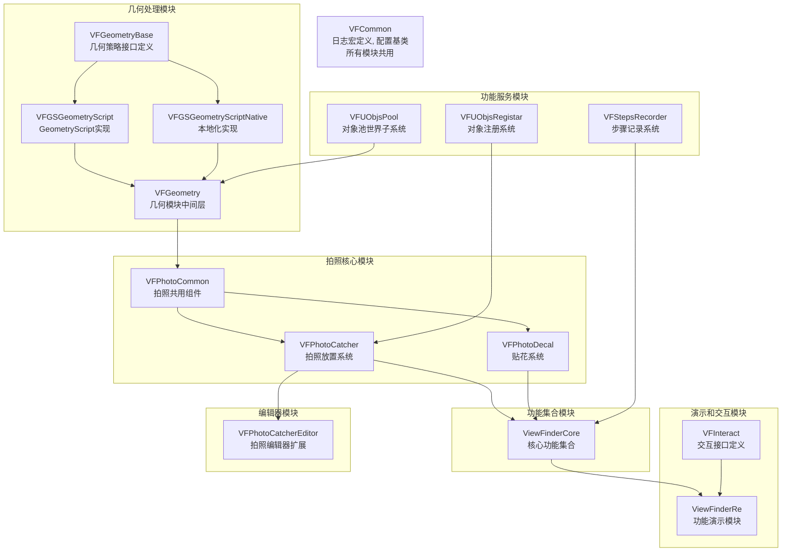
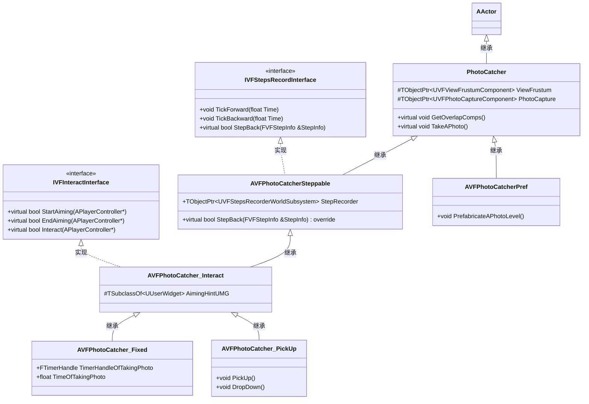
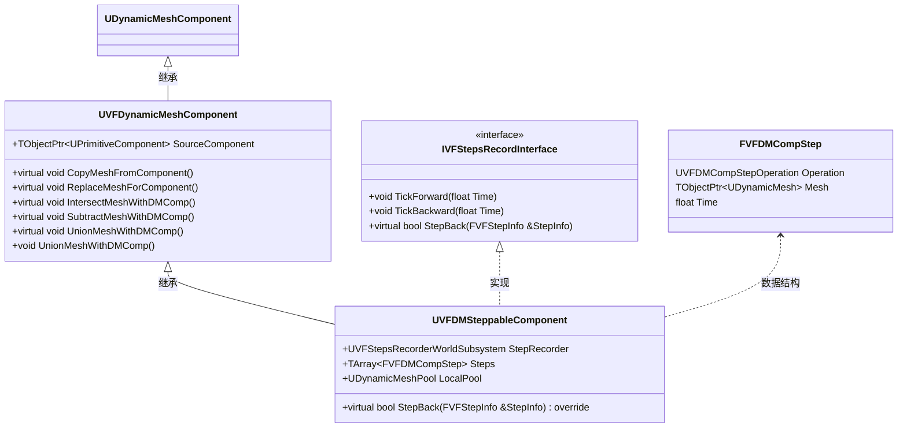
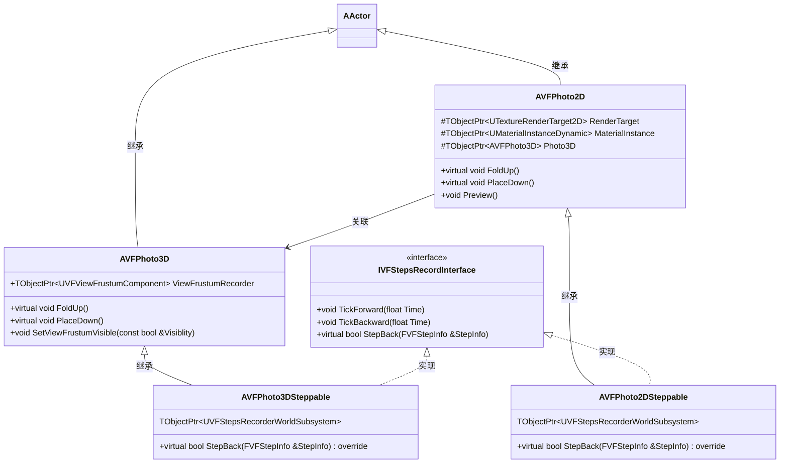
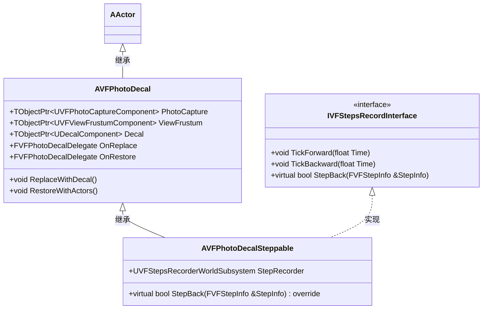
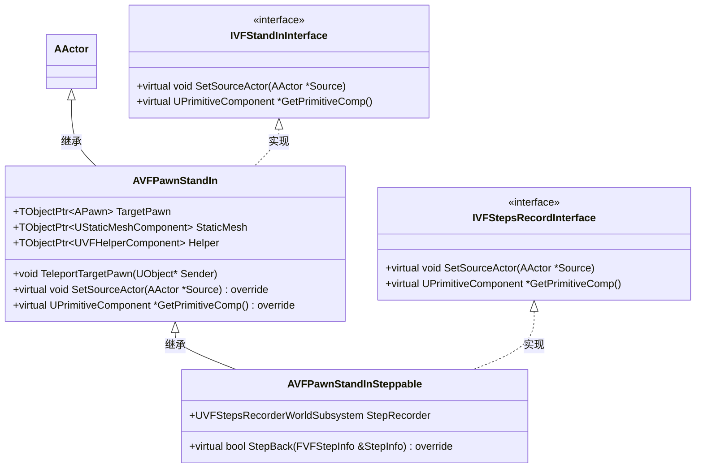
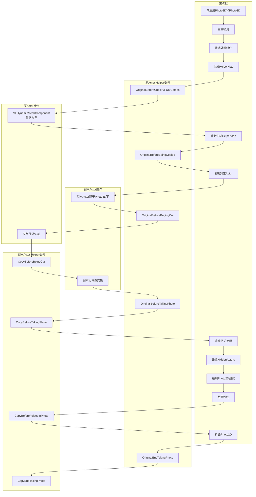
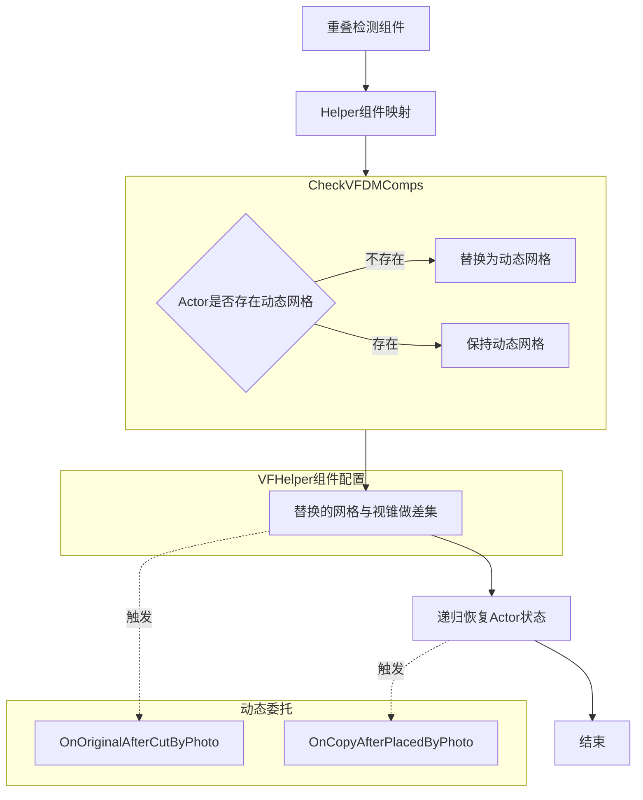
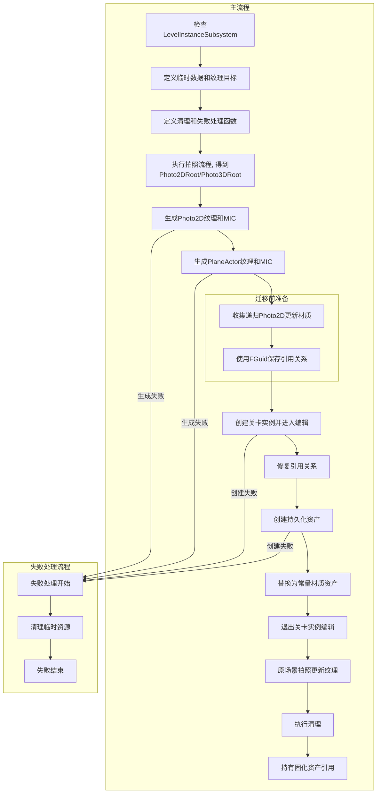

# :video_game: ViewFinderRe - Unreal Engine 5 插件

<a id="information_source前置声明"></a>
## :information_source:前置声明

**学习项目, 无商业目的, 请仅作为学习用途.**  
这是对
[ViewFinder](https://img.shields.io/badge/ViewFinder制作组-SOSGames-Green.svg)
的尊重:sparkling_heart:

使用UE5.3.2发行版开发, 包装成插件, 项目是一个空壳  
**仅测试Windows, 单机不支持网络**  
基于动态网格体组件. 依赖插件
[GeometryScript](https://img.shields.io/badge/Plugin-GeometryScript-Green.svg)
(可选), 可独立使用  
随缘更新和维护, 也可能不再更新  

[](LICENSE)
[](https://space.bilibili.com/239325439)
[]()

:book: [**中文**](README.zh.md) | [**English**](README.md)  
维护中文文档, 使用AI辅助翻译其它版本  

<a id="sparkles-特性"></a>
## :sparkles: 特性

<a id="video_game-复刻机制"></a>
### :video_game: 复刻机制
- **照片⇄物体** - 完整的拍照放置流程, 支持预制照片
- **图案⇄物体** - 支持基础和带场景切割的转换  
- **时间回溯系统** - 支持所有机制的撤销重做
- **进阶功能** - 替身显示, 滤镜照片, 递归照片等

<a id="hammer_and_wrench-设计特色"></a>
### :hammer_and_wrench: 设计特色
- **即插即用** - 最少仅需勾选"允许CPU访问"即可使用
- **低侵入性** - 动态网格组件自动装卸, 最小化场景改动
- **高度可配置** - 蓝图资产+项目级多层级配置(DeveloperSettings)
- **框架化设计** - 组件池, 功能模块化, 接口解耦等

<a id="dart-演示关卡"></a>
### :dart: 演示内容
- **演示关卡(L_Demo)** - 展示所有功能, 附带文字讲解
- **全机制回溯支持** - 演示关卡内所有操作均可撤销
- **视频演示** - [待录制]

<a id="warning-已知问题"></a>
### :warning: 已知问题
- **未实现相对阴影**, 使用默认动态光照
- 图案⇄物体中, **颜色无法完全匹配**
- 动态网格**存在重叠检测失效**的情况(很少)
- 不支持地形, 除了静态网格外都未进行测试
- 详见[常见问题](#常见问题)和[未实现猜测](#未实现猜测)

<a id="rocket-适合用户与使用场景"></a>
### :rocket: 适合人群和使用场景

**对于关卡设计师/策划**
- 已有功能都进行了高度封装, 使用门槛较低, 包括:
  - 各功能层级的蓝图, 按需使用
  - 大量可配置参数暴露, 无需编码即可调试
- 可使用蓝图实现自定义逻辑, 理论上覆盖ViewFinder所有相关玩法
  - 滤镜门没做, 详见[未实现猜测](#未实现猜测)中关于滤镜门的表述
- 内置编辑器工具, 支持跨关卡预制照片, 递归照片

**对于UE学习者**
- 完整开源代码, 讲解游戏机制的技术实现方式
- 模块化架构, 许多设计模式实践
- 详细的注释和技术文档, 讲解关键设计决策

**对于技术开发者**
- 可扩展的框架设计, 关键流程提供接口和委托, 可二次开发
- 组件化的非侵入式架构, 一个关于"如何集成到现有项目", 可能的解决方案
- 一些踩过的坑, 已实现的技术方案, 未实现的技术猜想

<details>
  <summary style="font-weight: bold; font-size: 1.3em;">
    &#x1F4CB;目录
  </summary>

## :clipboard:目录
- [:information\_source:前置声明](#information_source前置声明)
- [:sparkles: 特性](#sparkles-特性)
  - [:video\_game: 复刻机制](#video_game-复刻机制)
  - [:hammer\_and\_wrench: 设计特色](#hammer_and_wrench-设计特色)
  - [:dart: 演示内容](#dart-演示内容)
  - [:warning: 已知问题](#warning-已知问题)
  - [:rocket: 适合人群和使用场景](#rocket-适合人群和使用场景)
- [:clipboard:目录](#clipboard目录)
- [效果展示](#效果展示)
  - [:camera: 照片⇄物体](#camera-照片物体)
  - [:art: 图案⇄物体](#art-图案物体)
  - [:previous\_track\_button: 时间回溯](#previous_track_button-时间回溯)
- [体验和使用](#体验和使用)
  - [*快速上手*](#快速上手)
    - [使用插件](#使用插件)
    - [体验演示地图](#体验演示地图)
  - [*术语表*](#术语表)
  - [*在现有项目中使用*](#在现有项目中使用)
    - [前置准备](#前置准备)
    - [设计考虑](#设计考虑)
    - [最少操作](#最少操作)
    - [最小支持(最少影响)](#最小支持最少影响)
  - [*配置拍照行为和插入自定义逻辑*](#配置拍照行为和插入自定义逻辑)
  - [*预制照片*](#预制照片)
  - [*图案-\>物体*](#图案-物体)
  - [*物体-\>图案*](#物体-图案)
  - [*可配置项*](#可配置项)
- [进阶使用](#进阶使用)
  - [*进阶制作预制照片*](#进阶制作预制照片)
  - [*使用替身*](#使用替身)
  - [*使用时间回溯系统*](#使用时间回溯系统)
  - [*制作递归照片*](#制作递归照片)
  - [*制作递归图案-\>场景*](#制作递归图案-场景)
  - [*完全剥离模块`VFGSGeometryScript`*](#完全剥离模块vfgsgeometryscript)
- [常见问题](#常见问题)
  - [*bAllowCPUAccess*](#ballowcpuaccess)
  - [*投影图案颜色不匹配*](#投影图案颜色不匹配)
  - [*使用了GeometryScript的哪些功能*](#使用了geometryscript的哪些功能)
  - [*如何插入自己的逻辑*](#如何插入自己的逻辑)
  - [*关闭VSM*](#关闭vsm)
  - [*没做关卡切换*](#没做关卡切换)
  - [*重叠检测失效*](#重叠检测失效)
- [技术细节](#技术细节)
  - [*图案物体转换*](#图案物体转换)
  - [*动态网格*](#动态网格)
  - [*动态网格体组件的动态装卸*](#动态网格体组件的动态装卸)
  - [*通用拍照流程*](#通用拍照流程)
  - [*Helper组件定义Actor行为*](#helper组件定义actor行为)
  - [*预制照片流程*](#预制照片流程)
  - [*回溯子系统*](#回溯子系统)
  - [*支持回溯的动态网格组件*](#支持回溯的动态网格组件)
- [其它技术细节](#其它技术细节)
  - [*贴花透视投影*](#贴花透视投影)
  - [*VFTransformRecorderActor*](#vftransformrecorderactor)
  - [*替身*](#替身)
  - [*背景面*](#背景面)
  - [*滤镜*](#滤镜)
  - [*照片容器*](#照片容器)
  - [*Interactable \& Activatable*](#interactable--activatable)
  - [*插件依赖及处理*](#插件依赖及处理)
  - [*模块拆分*](#模块拆分)
  - [*FrustumGenerator*](#frustumgenerator)
- [其它](#其它)
  - [*模块图*](#模块图)
    - [模块拆解](#模块拆解)
    - [VFCommon](#vfcommon)
    - [VFUObjsPool](#vfuobjspool)
    - [VFUObjsRegistar](#vfuobjsregistar)
    - [VFStepsRecorder](#vfstepsrecorder)
    - [VFGeometryBase](#vfgeometrybase)
    - [VFGSGeometryScript: 依赖VFGeometryBase](#vfgsgeometryscript-依赖vfgeometrybase)
    - [VFGSGeometryScriptNative: 依赖VFGeometryBase](#vfgsgeometryscriptnative-依赖vfgeometrybase)
    - [VFGeometry](#vfgeometry)
    - [VFPhotoCommon](#vfphotocommon)
    - [VFPhotoCatcher](#vfphotocatcher)
    - [VFPhotoCatcherEditor](#vfphotocatchereditor)
    - [VFPhotoDecal](#vfphotodecal)
    - [ViewFinderCore](#viewfindercore)
    - [VFInteract](#vfinteract)
    - [ViewFinderRe](#viewfinderre)
  - [*类图*](#类图)
    - [PhotoCatcher相关, 最为复杂, 设计两层接口和功能衍生](#photocatcher相关-最为复杂-设计两层接口和功能衍生)
    - [动态网格体相关, 拍照后网格体都会被用它来替代](#动态网格体相关-拍照后网格体都会被用它来替代)
    - [Photo2D和Photo3D, 分别作为手中的照片和场景中的照片](#photo2d和photo3d-分别作为手中的照片和场景中的照片)
    - [PhotoDecal, 与其它的交互最少, 结构最清晰](#photodecal-与其它的交互最少-结构最清晰)
    - [PawnStandIn: 在Pawn被拍到时, 用之替换](#pawnstandin-在pawn被拍到时-用之替换)
  - [核心流程](#核心流程)
    - [拍照流程图](#拍照流程图)
    - [Photo3D放置, 覆盖场景](#photo3d放置-覆盖场景)
    - [预制照片流程图](#预制照片流程图)
  - [*未实现猜测*](#未实现猜测)
  - [*ViewFinder流程拆解*](#viewfinder流程拆解)
  - [*Demo流程设计*](#demo流程设计)
  - [*资产列表*](#资产列表)
  - [*ToDoList*](#todolist)
</details>

## 效果展示
使用GIF进行展示, 但刷新很慢

<a id="camera-照片物体"></a>
### :camera: 照片⇄物体
|                                                                            |                                                                        |
| :------------------------------------------------------------------------: | :--------------------------------------------------------------------: |
|  |  |
|                          对模拟物理的物体进行拍照                          |                                不同视锥                                |
|         |              |
|                         不同配置的Actor有不同响应                          |                              剪切而非复制                              |
|               |        |
|                                  滤镜效果                                  |                                递归照片                                |
|                                                                            |                                                                        |

<a id="art-图案物体"></a>
### :art: 图案⇄物体
|                                                                    |                                                                    |
| :----------------------------------------------------------------: | :----------------------------------------------------------------: |
|  |  |
|                             图案->物体                             |                             物体->图案                             |
|                                                                    |                                                                    |

<a id="previous_track_button-时间回溯"></a>
### :previous_track_button: 时间回溯
|                                                               |                                                                              |
| :-----------------------------------------------------------: | :--------------------------------------------------------------------------: |
|  |  |
|                           相片回溯                            |                           图案->场景回溯和再次触发                           |
|                                                               |                                                                              |

## 体验和使用

### *快速上手*
你可以[使用插件](#使用插件), 完成[前置准备](#前置准备)后, [体验演示地图](体验演示地图)  
也可以直接使用该项目进行体验, 项目是仅包含了插件的空壳  

#### 使用插件
1. 解压插件放置到YourProject/Plugins/下. 如果Plugins文件夹不存在, 需要手动创建
2. 打开你的项目, 在插件面板中, 搜索ViewFinderRe并启用
3. 完成[前置准备](#前置准备)
#### 体验演示地图
1. 打开演示地图: Plugins/ViewFinderRe/Content/Maps/L_Demo
2. 运行, 场景中附带了讲解, Have fun!

努力上架Fab中…

### *术语表*
后面会出现一些项目特有的词, 或可能引起歧义, 在此统一说明
- `PhotoCatcher`: 拍照使用的相机. 拍照时会生成Photo2D和Photo3D
- `Photo2D`: 显示图案, 能够持有的相片. 持有对Photo3D的引用
- `Photo3D`: 没有实体, 持有视锥, 管理相片中实体的Actor
- `PhotoDecal`: 使用贴花图案, 并(管理)替换实体的Actor. 图案与物体转换的主要实现
- `ViewFrustum`: 视锥, 或指视锥的形状
- `Filter/Post process filter`: 相机后处理滤镜
- `Projection`: 指使用贴花显示物体的图案, 它更像是对一个图案进行投影
- `PlaneActor`: 拍照时对于天空盒等背景内容单独捕获的图像, 然后作为一个平面显示的东西, 详见[背景面](#背景面)
- `StandIn`: 某些物体被拍照时, 会使用一个替身, 进行后面的流程

### *在现有项目中使用*

#### 前置准备
1. 打开编辑器
2. 确保碰撞通道(Object Channels)存在`ViewFrustum`, 无则新建, 设置如图:   

3. 确保碰撞预设(Preset)存在`ViewFrustum`, 无则新建, 设置如图:  

4. `ProjectSettings > Engine > Render`进行配置
   1. `Shadow Map Method`改为`ShadowMaps`
      1. 场景捕捉与VSM有冲突, 参看[关闭VSM](#关闭VSM)
      2. 实测5.6.1不需要手动关闭
   2. `Custom Depth-Stencil Pass`, 设置为`EnabledWithStencil`
      1. 如不开启, 滤镜后处理出错
5. `ProjectSettings > ViewFinderRe > VFGeometryDeveloperSettings > GeometryStrategyClass``改为VFGSGeometryScriptNative`
6. 重启编辑器

#### 设计考虑
`从偷懒上说`, 场景最好什么都不用动, 相机一视同仁, 都可拍照复制  
`从项目上说`, 功能最好能够限制范围, 相机仅对特定的物体生效就可以了  
`从技术上说`, 目前已测试和实现静态网格, 其它很多类型支持未知    
有两套解决方案/使用方法:

#### 最少操作
1. 打开现有地图, 或者"新建新关卡-基础"
2. 重载游戏模式为`BP_VF_GameMode`
3. 搜索蓝图`BP_PhotoCatcher_PickUp`, 并拖入到场景中
4. 运行, 拾取`PhotoCatcher`, 拍照, 放置照片

你可能触发了断点(Mesh Xxx bAllowCPUAccess needs to be true)参看[bAllowCPUAccess](#ballowcpuaccess)

#### 最小支持(最少影响)
如果你尝试过`新建新关卡 > 开放世界`, 将会出现报错, 原因是不支持地形  
我们也使用这个为例子: 设置仅支持(影响1)的Actor:
1. 打开现有开放世界地图, 或者`新建新关卡 > 开放世界`
2. 重载游戏模式为`BP_VF_GameMode`
3. 搜索蓝图`BP_PhotoCatcher_PickUp`, 并拖入到场景中
   1. 勾选该蓝图实例的`Only Overlap with Helper`
   2. (可选)取消勾选`Generate APlane Actor`
4. 搜索蓝图`BP_PhysicsCube_WithHelper`, 并拖入到场景中
5. (可选)加入任意Actor, 例如`Shape > Cylinder`
   1. 其上添加`VFHelper`组件, 配置无需改动
   2. `项目设置 > ViewFinderRe > VFPhotoCommonDeveloperSettings`中, 修改`Helper Getting`为`By Get Component by Class`
6. 运行, 拾取`PhotoCatcher`, 拍照, 放置照片

你应当写自己的交互逻辑. 提供的游戏模式仅作为体验和测试, 其包括了:
1. `BP_VF_HUD`: 简单显示时间的UHD
2. `BP_VF_PlayerController`: 时间回溯的按键触发等
3. `BP_VF_Character`: 按键响应, 射线检测(交互物体)等

### *配置拍照行为和插入自定义逻辑*
这次使用另外一种Helper组件的查找方式
1. 在`项目设置-ViewFinderRe-VFPhotoCommonDeveloperSettings`, 设置`Helper Getting`为`By VFHelper Interface`
2. 创建一个Actor蓝图, 创建并挂载静态网格组件, 设置静态网格体为`SM_ChamferCube`
3. 添加`VFHelper`组件
   1. 设置`Show in Photo Rule`为`Neither`
   2. 可选, 取消勾选`Can be Placed by Photo`
4. Helper组件事件中, 在`On Original End Taking Photo`上点击创建, 连出节点`Print`, 打印你需要的信息
5. Actor实现接口`VFHelperInteface`, 重写函数`GetHelper`, 将Helper组件通过这个函数返回
6. 将它放入场景进行测试. 它会被拍照, 打印信息, 但不会在`Photo2D`中显示. (可选, 不会被Photo3D覆盖)

`VFHelper`组件的动态多播事件, 其意义和顺序请参看[通用拍照流程](#通用拍照流程)和[Helper组件定义Actor行为](#helper组件定义actor行为)

### *预制照片*
1. 新建关卡(不要使用地形), 搭建需要的场景
2. 放置`BP_PhotoCatcherPref`
   1. 鼠标右键它, 使用"Pilot"到你想要的位置
   2. 右键浅绿色视锥, 停止"Pilot"
3. 打开`BP_PhotoCatcherPref`实例的细节面板, 设置拍照相关数据
   1. 调整参数: 例如视锥视角, `Only Overlap with Helper`, `Object Types to Overlap`等
   2. `Only Actors Catched`有数据的时候, 只会对这些照相.
   3. `Actors to Ignore`则可以排除想要忽略的内容
4. 在细节面板中, 点击`Prefabricate A Photo Level`按钮调用CallInEditor函数, 制作`_Photo`
   1. 选择路径保存新关卡, 推荐与当前关卡同一层级, 并加上后缀`_Photo`
   2. 无视并确认接下来出现的警告: `Actor BP_Photo3DSteppable is referenced by other Actors/objects.Do you really want to delete it? This will break references.`
   3. 在选择的路径下, 除了刚刚创建的新关卡, 还会生成2个纹理, 2个材质实例. 它们分别是相片的纹理和材质实例, 和背景图片的纹理和材质实例
5. `_Photo`关卡就是一张预制的照片, 你可以把它放置在其它关卡中, 它会以照片存在
6. 注意: 删除的时候, 请先删除纹理和材质实例资产, 然后再删除地图_Photo
   1. 不然会出现编辑器崩溃, 原因未知, 猜测可能是循环引用的问题

### *图案->物体*
1. 搭建场景
2. 放置`BP_PhotoDecalSteppable_Show`, "Pilot"到合适的位置
   1. 调整视锥远平面, 过远没有意义, 近一点节省性能
   2. 将需要变成图案的物体添加到`Managed Actors`
   3. 根据情况勾选`Only Catch Managed Actors`
      1. 勾选后将不会捕获其它物体, 即场景捕获使用`PRM_UseShowOnlyList`
      2. 注意, 勾选后将不会捕获其它物体的影子
3. 细节面板切换到Decal组件, 使用本地坐标系, 仅使用**X轴正向**, 移动到图案应该出现的位置
   1. 不要调整贴花的缩放, 它由`AVFPhotoDecal::OnConstruction`控制.
      1. 你可以调整的是DecalSize, 但最好是标准立方体
   2. 调整组件CaptureOfDecal的`Target Width`和`Target Height`:
      1. 相机的宽高比被这两个属性锁定, 修改会自动调整相机的宽高比
      2. 影响贴花的质量
4. `DetectionArea`的位置一般不需要移动, 将使用玩家相机的位移和朝向与它进行比较
5. 使用关卡蓝图, 使用其引用手动调用`ReplaceWithDecal`
   1. 在编辑器中, 图案中光照可能很奇怪, 但打包后就是正常的
   2. 如果想保证光照正常, 可以使用`Delay`节点, 延迟0.2秒
6. 勾选了`Keep First Replacement`, 时间回溯将不会回溯"第一次变成图案"的操作

### *物体->图案*
1. 搭建场景
2. 放置BP_PhotoDecalSteppable_Hide, "Pilot"到合适的位置
   1. 调整视锥远平面, 过远没有意义, 近一点节省性能
   2. 将需要变成图案的物体添加到`Managed Actors`
   3. 根据情况勾选`Only Catch Managed Actors`
      1. 勾选后将不会捕获其它物体, 即场景捕获使用`PRM_UseShowOnlyList`
      2. 注意, 勾选后将不会捕获其它物体的影子
3. 细节面板切换到Decal组件, 使用本地坐标系, 仅使用**X轴正向**, 移动到图案应该出现的位置
   1. 不要调整贴花的缩放, 它由`AVFPhotoDecal::OnConstruction`控制.
      1. 你可以调整的是DecalSize, 但最好是标准立方体
   2. 调整组件CaptureOfDecal的`Target Width`和`Target Height`:
      1. 相机的宽高比被这两个属性锁定, 修改会自动调整相机的宽高比
      2. 影响贴花的质量
4. 移动DetectionArea的位置和大小, 它就是触发隐藏的区域

### *可配置项*
1. 蓝图中暴露了许多可配置属性, 它们的类别都是`ViewFinder`, 你还可以通过属性分段`ViewFinderRe`来进行筛选
2. `项目设置 > ViewFinderRe`下还有许多配置项

## 进阶使用

### *进阶制作预制照片*
对于插件使用者, 预制照片很可能会进行多次迭代: 有时候需要重新拍照物体, 而有些时候仅需要更新一下照片图案  
对于插件维护者, 预制照片全是编辑器世界内操作, 本身代码极其复杂. 然后特殊处理的类, 例如将`Photo2D`处理成递归照片, 在考虑到未来可能还会有各种行为的类, 维护将变得极其麻烦  

下面从灵活度从低到高, 给出制作的操作:
- 对于`一般的场景内容`, 无需过多关心, 它们会被很好的进行切割到新场景  
- 对于`一个挂载Helper组件的蓝图类`, 动态多播是一开始就绑定的, 编辑器世界中也会运行, 但可能需要考虑保存和初始化的问题  
- 对于一个挂载Helper组件, 但`在BeginPlay中绑定多播的Actor`
  1. 编辑器世界中, 多播并没有被绑定, 也就不会进行响应的逻辑
  2. 在`_Photo`中手动进行它应该的逻辑, 建议使用CallInEditor进行调用
  3. 可选, 在网格组件下的动态网格体组件上, 点击`RestoreSouceComponentInEditor`销毁此动态网格体的替代.
     1. 这对于某些会对原网格进行处理的Actor很有用, 但对应的, 网格切割就没了
     2. 又或者是在BeginPlay中, 检测动态网格体组件进行特殊处理
- 对于`任意Actor`
  1. 在生成_Photo新关卡后, 放置到新场景的Photo3D层级下
  2. 在原关卡相应位置也放置一个一模一样的
  3. 原关卡之前的Pref相机的细节面板下, 点击UpdateMIC按钮
  4. 可考虑使用插件ActorPalette来同步位置

### *使用替身*
首先是一个简单使用, 让任意Actor被拍照时, 使用一个替身
1. 添加`Helper`组件, 并进行配置:
   1. 将`bReplacedWithStandIn`设为`true`
   2. 将`StandInClass`设为`BP_CubeStandIn`

接下来是如何创建一个替身Actor, 请参照`BP_CubeStandIn`
1. 创建一个Actor, 实现`VFStandInIterface`接口
2. 重写`GetPrimitiveComp`函数, 返回你想要在相片中显示的网格体组件
3. 添加`Helper`组件, 并配置这个替身在拍照流程中的表现

需要注意`IVFStandInInterface::GetOriginalActor`:
- 在由c++类继承接口出来的, 如`BP_PawnStandInSteppable`, 它是正常工作的, 你可以通过该函数获得原Actor的引用
- 在纯蓝图类, 如`BP_CubeStandIn`, 它不会正常工作， 你需要参照`BP_CubeStandIn`创建一个蓝图变量进行记录
- 原因还未确定

### *使用时间回溯系统*
先介绍两种使用方式

如果要记录物体的Transform等信息, 后面称Data:
1. Actor继承`VFStepsRecorderInterface`接口
2. 重写`TickForward`函数
   1. 本地维护一个Data的数组
   2. 每次与数组的最后一个进行比较, 如不同则尾增一份当前Data
3. 重写`TickBackward`函数
   1. 被调用说明正在回溯
   2. 根据Data数组进行, 计算并应用这一帧应该回溯到的Transform等数据
4. `BeginPlay`中, 或者应该开始被`TickForward`的时候, 向回溯系统注册(`RegisterTickable`)
5. 销毁时, 或不该继续被`TickForward/TickBackward`的时候, 反注册`UnregisterTickable`

以`PhotoCatcher`进行拍照进行举例(`AVFPhotoCatcherSteppable`):
1. `PhotoCatcher`继承`VFStepsRecorderInterface`接口
2. 拍照后, 创建一个`FVFStepInfo`, 并标注为关键时间点, 提交(`SubmitStep`)给回溯系统
3. 重写`StepBack`函数, 该信息会在对应时间点退回, 根据信息的内容做对应的反操作
   1. 这里并没有任何操作, 你可能感到疑惑
   2. `Photo2D`和`Photo3D`的销毁交予了它们自身, 即回溯到创建的时间就销毁
   3. 这是自我管理的想法, 更自由也能避免太多逻辑交叉
   4. `Photo2D`和`Photo3D`都进行了自我管理, 于是"回溯到上个关键点"就由`PhotoCatcher`进行了

你还可以查看[回溯子系统](#回溯子系统), 有更详尽的解释
- `VFStepsRecorderWorldSubsystem`还提供了:
  - 一个统一的数组预分配大小
  - 提供了`RecordTransform`和`UnrecordTransform`, 方便了`AVFTransformRecorderActor`的使用
  - 提供了`StartRewinding`和`EndRewinding`的动态多播
  - 考虑未来的拓展(手动设置开始和结束区间), 提供`SetTimeOfStart`和`SetTimeOfEnd`等
    - 最开始的为了解决流式关卡加载, 回溯到`TIME_MIN`会销毁的问题
    - 又考虑到时间区间确实可以是一个玩法小机制, 故作保留
  - 宏`DECLARE_STEPSRECORDER_SUBSYSTEM_ACCESSOR`, 用来简化子系统的声明和使用

### *制作递归照片*
1. 搭建好场景
2. 将蓝图`BP_Photo2DSteppable`放入场景, **勾选`bIsRecursive`**
3. 放入Pref相机到你想要的位置和角度
4. 按钮调用`PrefabricateAPhotoLevel`函数
5. Pref相机按钮调用`UpdateMIC`多次, 更新相片图案的递归效果, 直到你满意

比想象中简单对吧? 具体实现在[预制照片流程](#预制照片流程)中有所讲解

### *制作递归图案->场景*
这个的制作就比较复杂了, 以`L_A7`为例:
1. 制作场景`L_A7_Base`, 确定递归部分
2. 使用Pref相机进行拍照, 通过设置`ActorsToIgnore`, 只拍摄递归部分, 生成新关卡`L_A7_Recursive_Start`
3. 复制L_A7_Base作为L_A7, 并将递归部分使用L_A7_Recursive进行替换
4. 放置并调整`BP_PhotoDecalSteppable_Recursive`, 设置`ManagedActors`
   1. 该Actor会在`OnDestroy`时, 手动销毁`ManagedActors`
5. `L_A7_Recursive_Start`关卡蓝图中:
   1. 引用`BP_PhotoDecalSteppable_Recursive`, 加入生成新的关卡实例逻辑, 并持有新的关卡实例引用
   2. 使用`Delay`节点调用`BP_PhotoDecalSteppable_Recursive`的`ReplaceWithDecal`, 保证编辑器中的光照正确
   3. 实现`VFStepsRecorderInterface`接口, 重写`StepBack`, 将新的关卡实例引用卸载
6. 复制`L_A7_Recursive_Start`为`L_A7_Recursive`
   1. 内容基本一致, 除了没有`Delay`节点, 立马加载新的关卡实例
7. 理论上, 只要正确的卸载关卡实例即可. 但实践下来, 时间回溯子系统中会持有硬引用, 导致不会正确卸载， 故`BP_PhotoDecalSteppable_Recursive`中需要手动调用`Destroy`

### *完全剥离模块`VFGSGeometryScript`*
1. 确保当前的`GeometryStrategyClass`**不**为`VFGSGeometryScript`
2. 关闭`GeometryScript`插件
3. 如果你仅想剥离插件`GeometryScript`, 到此就可以了, 模块`VFGSGeometryScript`不会自动启用
4. 修改`ViewFinderRe.uplugin`, 删除对于模块`VFGSGeometryScript`的描述
5. 可选, 修改`FVFGeometryBaseModule::StartupModule()`, 删除关于`VFGSGeometryScript`模块的加载
6. 如果出错了可修改`DefaultViewFinderReSettings.ini`, 删除`GeometryStrategyClass`配置, 退回到使用`VFGSNone`

## 常见问题

### *bAllowCPUAccess*
`UStaticMesh::bAllowCPUAccess`, 官方注释描述:  
```
- If true, will keep geometry data CPU-accessible in cooked builds, rather than uploading to GPU memory and releasing it from CPU memory
- This is required if you wish to access StaticMesh geometry data on the CPU at runtime in cooked builds (e.g. to convert StaticMesh to ProceduralMeshComponent)
```

进行布尔运算的静态网格体, **应当被勾选该属性**(使用了ensure进行验证)  
如果该属性没有被勾选, 虽然编辑器下看起来是正常运行的, 但打包后就会无法访问数据, 进而导致布尔运算出错  

### *投影图案颜色不匹配*
`PhotoDecal`的`Projection`的图案颜色, 无法与场景完全一致, 共有两个原因:

首先*场景捕捉的本身就与玩家相机颜色存在偏差*, 最接近的设置是:
- 后处理体积中开启`Global Illumination`, 设置方法为`Lumen`
- 后处理体积中开启`Reflections`, 设置方法为`Lumen`
- `ShowFlags`不显示大气
- 一个可能的解决方案: [插件CameraCapture](https://github.com/nofairy/UE_CameraCapture_Plugin)  

然后是"*二次光照*"(我也不知道如何称呼)  
1. 场景捕捉捕获的物体, 经过了一次光照计算流程, 成为了贴花的图案
2. 贴花赋予到物体上, 再经过了一次光照计算流程, 进入玩家视角

试图消除一次光照流程:  
- 第一个光照阶段可通过修改ShowFlags, 能实现获取"光照计算前"的基础颜色, 但捕获的图像将没有阴影. 且会使用贴花应用处的光照, 理应使用原本位置的光照  
- 第二个阶段中, 贴花也无法调整着色模型, 使用**自发光**来跳过光照计算  

暂时没有找到解决方案, 最后的结果是:
- 贴花在光照强的地方偏亮, 光照弱的地方偏暗  
- 使用`UVFPhotoDecalDeveloperSettings::PhotoDecalLightFix`进行简单的光照修正, 根据当前颜色值反向抵消一次光照计算  
- 一个可能的解决方案是, 自定义贴花的混入时机, 在光照流程后混入

### *使用了GeometryScript的哪些功能*
- 查看接口`IVFGeometryStrategyInterface`, 它是使用功能的抽象策略接口
- 查看类`UVFGSGeometryScript`, 它是依赖该插件实现功能的策略类

### *如何插入自己的逻辑*
- 使用`Helper`组件, 里面有多个动态多播, 你需要理解[通用拍照流程](#通用拍照流程)才能知道这些委托的意义和顺序  
- 图案⇄物体也提供了动态多播  
- [进阶使用](#进阶使用)中讲解了许多的拓展, 包括替身, 时间回溯系统的拓展使用

### *关闭VSM*
需要关闭VSM(Virtual Shadow Map)  
场景捕捉与虚拟阴影贴图不兼容. 在使用VSM时, 捕捉到的阴影会出现块状缺失  
项目已关闭VSM. [官方对此问题的描述](https://dev.epicgames.com/documentation/en-us/unreal-engine/virtual-shadow-maps-in-unreal-engine#scene-capture)  
但在5.6.1版本下, 实测没有问题, 但没找到已修复的相关公告  

### *没做关卡切换*
没做ViewFinder式的关卡切换, 详见[未实现猜测](#未实现猜测)

### *重叠检测失效*
视锥偶尔碰撞检测不到物体, 换个角度/位置, 甚至重新来一次就行, 原因不确定  
通过视锥分段(commit: [6423631](https://github.com/StrangeDS/ViewFinderRe/commit/6423631) [7794c81](https://github.com/StrangeDS/ViewFinderRe/commit/7794c81)), 已排除**三角面被过分拉长, 导致重叠检测失效**的可能  
可能是物理系统底层的问题, 实测长条状物体与另一个物体重叠, 穿过两个面, 而没有与任何边重叠, 就可能会重叠检测失效  

## 技术细节
这里不会有代码出现, 更多的是设计考量和实现思路  
尽量使用STAR的结构, 但没怎么被正规规范过, 可能与你想象有所不同  
个人理解为: S是直观现象的描述, T是技术层面的拆解, A是具体实现, R是评价结果  
技术细节较多, 这里列出的是较为核心的, 其它的在[其它技术细节](#其它技术细节)  

### *图案物体转换*
这个比较简单, 与其他的耦合也少, 所以放到最前面  

- Situation (S):  
ViewFinder中的案例: 部分物体的图案在特定角度变回为物体; 场景中部分物体在多种触发条件下(碰撞体积, 顺序性)变成图案; 图案能在特定角度拓展出一个场景  
- Task (T):  
提供基础功能: 提供生成图案; 图案与物体互斥的显示; 需要有动态多播作为拓展  
衍生类进行具体功能实现, 碰撞可能是Actor, 也可以是一个组件方便使用
- Action (A):  
物体->图案: 很明显需要使用场景捕捉获得图像, 然后作为材质参数  
图案: 能够附着在不同物体表面, 要适应各种角度, 这看起来就像是一个贴花  
物体需要能指定范围, 可通过场景捕捉的`PRM_UseShowOnlyList`实现  
贴花需要改造: 近小远大符合透视, 且只显示在第一个表面. 详细见[*贴花透视投影*](#贴花透视投影)  
图案->物体: 也需要之前的流程, 但不显示贴花, 而是物体  
- Result (R):  
1. 基础类`PhotoDecal`提供基础的图案⇄物体功能
     - 可设置`bOnlyCatchManagedActors`控制`PrimitiveRenderMode`
     - 携带视锥, 可视化范围, 为后续的场景破坏提供可能
2. 衍生出`_Hide`, 特定位置触发物体->图案
    - 附带一个碰撞检测, 来触发物体变成图案
    - 退出区域, 将进行还原, 便于测试
    - 固定性变化应当使用Actor的碰撞
3. 衍生出`_Show`, 自动调用物体->图案, 条件触发图案->物体
    - 携带一个碰撞, 检测玩家相机的Transform来进行触发(允许误差)
    - 参数设置是否通过视锥来切割当前场景
    - 一个简单的矫正到正确Transform的功能

### *动态网格*
现在我们开始考虑如何实现拍照功能  
- Situation (S):  
相机对场景拍照, 获得一张照片, 照片在面前放置, 相片里面的物体又变回了实体, 出现在场景中  
- Task (T):  
一个很容易想到的方案: 场景捕获获得图像, 它索引到一个隐藏的物体组. 直到照片放置的时候, 把隐藏的物体组显示出来  
网格体需要被实时布尔运算, 还需要能够实时计算碰撞  
需要自动支持模拟物体的Actor/组件  
- Action (A):  
决定运行时网格的选择, 备选项有`ProceduralMeshComponent`, `DynamicMeshComponent`, `RuntimeMeshComponent`  
- Result (R):  
布尔运算被包装到动态网格体组件(`VFDynamicMeshComponent`)内部, 调用蓝图函数库  
Actor本身没有挂载动态网格体组件, 而是在运行时, 第一次拍照时使用动态网格体组件进行替代, 详见[动态网格体组件的动态装卸](#动态网格体组件的动态装卸)
独立出`FVFDMCompRecordProps`, 用于抽离需要记录和还原, 以及自定义的数据  

简要介绍动态网格体组件的层级:  
`UDynamicMeshComponent`: 组件, 处理渲染, 碰撞, 材质等  
`UDynamicMesh`: UObject层级的动态网格体, 资产化和序列化  
`FDynamicMesh3`: 动态网格体数据  

### *动态网格体组件的动态装卸*
我们已经通过动态网格体组件实现了照片与物体的转换, 现在来考虑使用上的问题  
- Situation (S):  
作为使用者, 我肯定是希望尽量不对场景中的Actor进行改动, 它就能支持拍照功能  
- Task (T):  
动态网格体组件不应该是手动添加到场景Actor上的, 它应当是自动的  
- Action (A):  
动态网格体组件作为静态网格体组件的替身, 进行后续的布尔操作  
- Result (R):  
动态网格体组件可以作为任意静态网格体组件的替身, 在进行布尔操作前将其替代, 调用内部的布尔操作函数, 与视锥进行交/差的操作, 即可获得视锥内/外的网格  

好了, 但是按上面的思路是剪切, 而非复制  
- Situation (S):  
照片是复制视锥内的物体, 且剪切作为后期的一个玩法, 也需要存在  
- Task (T):  
需要完整复制视锥内的Actor, 作为复制体对视锥布尔交运算,得到相片内的物体  
场景原物体, 不进行操作则是复制, 对视锥进行布尔差运算即是剪切  
动态网格体组件是运行时动态添加的, 使用`SpawnActorParam`的`Template`虽然会复制该组件, 但却是浅拷贝, 动态网格体是同一个  
- Action (A):  
在Actor被复制之前, 先卸载掉动态网格体组件, 复制完后再添加回去(原因需看[支持回溯的动态网格组件](#支持回溯的动态网格组件)). 复制出来的Actor, 需要根据原物体的动态网格体组件更新自己的动态网格体  
- Result (R):  
给出新的复制Actor函数, 以及一个递归子Actor的复制Actor函数  

### *通用拍照流程*
源代码位于`AVFPhotoCatcher::TakeAPhoto_Implementation()`  
- Situation (S):  
使用动态网格体组件, 复刻ViewFinder拍照流程, 尽力还原和兼容更多功能  
- Task (T):  
将静态网格体组件使用动态网格体组件进行替换  
使用动态网格体组件与视锥进行布尔运算, 实现场景切割  
与其他小机制交互并保证拓展性  
- Action (A):  
做任何操作之前拍照× 所有操作之后拍照√ 因[滤镜](#滤镜)效果限制  
视锥只能使用简单碰撞(重叠检测), 其它物体优先使用简单碰撞  
使用Helper组件进行流程控制, 以及自定义逻辑拓展方式  
生成相片Photo2D和管理物体的Photo3D  
- Result (R):  
[拍照流程图](#拍照流程图)  
这里除了场景捕捉, 复制Actor和布尔运算外, 还需要注意的是多个机制的顺序  

### *Helper组件定义Actor行为*
现在考虑这个问题  
- Situation (S):  
ViewFinder中电池被拍照后, 如果有较大破损, 那么它是不可用的  
即有些物体对拍照有独特行为逻辑  
- Task (T):  
需要支持物体在拍照流程中有自定义的行为  
- Action (A):  
使用Helper组件, 不仅有通用流程的配置参数, 还携带多个动态多播, 在流程中被统一调用  
- Result (R):  
仅需使用Helper组件就能自定义行为  
[拍照流程图](#拍照流程图)  

### *预制照片流程*
[预制照片流程图](#预制照片流程图)

- Situation (S):  
ViewFinder中, 场景中存在一开始就存在的照片, 它可以是完全风格不一致的  
- Task (T):  
作为插件使用者, 这张照片应当是在另外的ULevel制作的, 放置在需要的ULevel中  
即便是已经制作的照片, 应当也可以支持修改和更新  
- Action (A):  
预制场景中BeginPlay中实时拍照× 还需要限制仅对当前关卡实例的Actor生效和管理  
考虑固化所有资产√ 动态网格体组件支持序列化, 还需要对相片纹理, 背景面纹理进行固化  
- Result (R):  
预制场景中放置Pref相机, 拍照后会将相关内容移到一个新的关卡, 即预制场景加工出预制照片场景  
固化相片和背景面的纹理(`IAssetTools::DuplicateAsset`), 并使用材质实例常量替换对应材质  

- Situation (S):  
使用LevelInstanceSubsystem->CreateLevelInstanceFrom迁移Actors到新的关卡实例, Photo2D对于Photo3D的引用关系将会消失  
- Task (T):  
引用关系必然被破坏, 需要重建引用关系  
里面很可能不止一个Photo2D和Photo3D, 甚至还有递归照片
- Action (A):  
在迁移前, Photo2D和对应的Photo3D, 都添加唯一的FGuid
迁移后, 根据FGuid重新建立引用关系
迁移后, Photo2D和PlaneActor的材质需要替换为固化资产
- Result (R):  
预制相片是一个新的Level, 意味着你其实可以对它进行改动  
持有固化资产的引用, 纹理图案可以更新  

- Situation (S):  
递归相片, 里面还有一张一样图案的相片, 放置后也能对它进行放置, 会出现一样的递归场景  
- Task (T):  
其实在已有框架下, 是很好实现的, 即使用`Helper`组件, 在外层的`Photo3D`被放置前, 完整的复制一份即可  
- Action (A):  
不是Photo3D里面的Photo2D都是递归的, 所以需要一个布尔值进行标识  
它可以完全在运行时进行处理, 编辑器中无需过多关心  
- Result (R):  
极简易的创建递归相片, 仅需勾选一个布尔值  
运行时BeginPlay自动绑定动态多播(递归复制Photo3D), 无需关心  

### *回溯子系统*
- Situation (S):  
回溯系统可以回溯位移, 网格体布尔运算等几乎所有操作  
- Task (T):  
需要一个通用性强, 拓展性强的回溯系统  
- Action (A):  
使用接口进行抽象, 无视具体类型  
- Result (R):  
提供"TickForward和TickBackward", "SubmitStep和StepBack"两种使用方式  

- 视TickForward和TickBackward为:
  - tick驱动, 高频持续调用
  - 本地存储帧级别数据, 使用增量进行优化
  - 访问者模式
  - 更多例子可见: `AVFTransformRecorderActor`, `AVFCharacter`
- 视SubmitStep和StepBack为:
  - 事件驱动, 低频瞬发操作
  - 统一管理轻量数据(FString), 较大数据也应该放到本地
  - 中介者模式
  - 更多例子可见: `AVFPhoto2DSteppable`, `AVFPhoto3DSteppable`
- 正确使用:
  - 管理自己
    - 你的任何操作, 回溯都理应由你自己进行
    - 数据应当尽量储存在本地, 提交到子系统的信息最好只是一个枚举类数据
  - 两种使用方式是应对的不同使用场景, 从需求进行抉择
  - 也可以组合使用, 这说明两种场景都有需求
    - 例如AVFPhotoContainerSteppable和UVFDMSteppableComponent, 两者都是: 虽然是事件驱动, 但需要记录较多以及不同类型数据, FVFStepInfo支持不够
  - 这样的方式可能很复杂, 但回溯系统并不关心具体的操作
    - 自由度极高, 任意Actor可以以任意的逻辑插入
    - 在较多回溯物体, 特别是有相互作用的情况下, 逻辑也较为清晰

### *支持回溯的动态网格组件*
考虑回溯的情况:  
- Situation (S):  
动态网格体在进行多次布尔操作后, 需要回溯到之前的样子  
动态网格体组件回溯到生成装载之前, 是否需要卸载掉?  
官方提供一个动态网格体的对象池  
- Task (T):  
动态网格体组件需要还原之前的动态网格体, 考虑使用布尔运算的逆操作, 但这样就需要知道布尔运算的另一个对象. 每个组件的每次都需要这样的记录, 使得复杂度极高  
另一个思路是在进行布尔运算之前, 就记录一次动态网格体, 这样只占用内存, 回溯将不再需要实时运算. 使用官方的对象池应当会有较好性能  
动态网格体组件在回溯到装载之前, 理应被卸掉
卸载和装载, 这明显应该是个对象池  
- Action (A):  
制作动态网格体组件的对象池, 且支持回溯的动态网格体内部还需持有动态网格体的对象池
- Result (R):  
制作了世界子系统, 支持实现了接口的任意UObject对象的池化, 支持根据类型的预生成  

这就是Actor复制时, 需要卸载再装回的原因, 要保证复制出来的Actor装载的动态网格体组件也能从对象池中取出使用

## 其它技术细节
这里的技术细节不太核心(对于ViewFinder的玩法而言), 但也值得一讲

### *贴花透视投影*
- Situation (S):  
图案在其它物体上的要符合透视投影: 近小远大  
- Task (T):  
贴花实现图案映在其它物体上, 但不符合透视投影  
- Action (A):  
使用相对距离和FOV计算缩放大小  
通过一张深度图像, 计算是否为第一个投影面, 转为不透明度避免后续的面出现图案  
- Result (R):  
代码位于AVFPhotoDecal::DrawDecal(), 材质参数在此给入  
材质位于ViewFinder/Plugins/ViewFinderRe/Content/Materials/Decal/M_Decal_Photolize  
不使用SCS_SceneColorSceneDepth的捕获源, 还需要单独捕捉一张深度图, 原因则是距离不好计算  

### *VFTransformRecorderActor*
- Situation (S):  
ViewFinder中所有的物体的transform都支持回溯  
- Task (T):  
作为项目插件, 应当是易用且可控的   
不应该嵌入到其它Actor内, 单独独立一个Actor, 记录多个网格体的回溯信息  
- Action (A):  
AVFTransformRecorderActor认为其下的基元组件重叠的网格体都应该是需要记录回溯的  
- Result (R):  
批量处理网格体, 支持带物理的Actor, 增量变动  
回溯子系统有一个`TMap<FString, AVFTransformRecorderActor>`的成员变量,作为一个更方便使用的入口  

### *替身*
- Situation (S):  
ViewFinder中拍照拍到玩家角色, 会显示一个黑影, 照片放置时, 玩家会瞬移到黑影的位置  
ViewFinder中猫是能感知到自己被拍照和放置的, 即便它看起来没有进入拍照流程  
- Task (T):  
拍照时被替换成了其他东西, 放置时能瞬移  
不应当直接与Character绑定, Actor级别也应当能使用  
- Action (A):  
使用Helper组件来标识其使用替身, 也记录替身的UClass类型  
替身能访问到之前Actor的信息  
使用接口(VFStandInInterface)进行抽象, 替身需要继承该接口  
- Result (R):  
拍照流程中只对替身进行特殊处理  
c++类使用SpawnActor可以复制接口的成员变量  
但蓝图类不可以, 只能在Actor层级增加一个成员变量供复制  
c++类可以偷懒, 故也保留  
接口函数返回一个基元组件供后续拍照流程使用, 替身对象也正常走完拍照流程, 故能感知相关操作

### *背景面*
- Situation (S):  
ViewFinder中能完美捕获天空盒上的图案  
图片放置的时候, 能观察到多个层级(建筑, 山, 云, 天空盒)  
- Task (T):  
天空盒也是可拍入的物体× 多次布尔运算后, 碰撞计算将出错  
有只捕获背景天空的场景捕获, 照片放置时生成一个平面, 展示图案  
生成的平面不参与拍照流程, 但能被捕获图像  
- Action (A):  
使用一个世界子系统, 用于注册和获得"背景"的Actor列表  
一个场景捕捉只捕捉注册的Actor列表  
拍照流程中生成一个显示背景图案的面  
- Result (R):  
对于多层次的东西, 应该还是使用重叠检测, 是一个面的网格体, 这样图案才不会被捕获到`PlaneActor`上  
相反, 你可以注册到子系统, 就可以被印到背景面`PlaneActor`上, 例如BP_SkyBox

### *滤镜*
- Situation (S):  
ViewFinder中有些相机, 拍照会有滤镜效果, 放置出来的物体也携带效果  
- Task (T):  
不同的物体可以有不同的后处理效果, 即便在同一个位置  
不同的相机有不同的效果  
- Action (A):  
使用自定义模板值(Stencil)来实现不同物体的区分  
拿起/放下相机的时候, 动态装卸后处理效果  
拍照流程中, 增加Stencil相关处理  
- Result (R):  
拍照流程调整为所有流程后进行拍照  
独立成组件UVFPostProcessComponent, 表达Stencil值的变动策略, 记录后处理材质等功能

### *照片容器*
- Situation (S):  
ViewFinder中可以Q/E切换当前照片  
- Task (T):  
切换照片的功能, 存放, 预览, 放置照片的入口  
需要支持回溯  
- Action (A):  
实现功能到类, 继承实现回溯(反操作)  
- Result (R):  
抽象接口(`VFPhotoContainerInterface`), 其它类可作为传递入口  
例如相片给到玩家角色, 实际是Character通过接口给到容器  

### *Interactable & Activatable*
- Situation (S):  
ViewFinder中: 可以对一些物体进行交互; 可以切换相机, 相片组, 空手  
- Task (T):  
射线检测对特定接口进行交互  
对原需求做一个拓展, 可以持有多个相机(参数, 滤镜), 设备数量将是动态的  
还需要复刻操作习惯  
需要支持回溯  
- Action (A):  
抽象接口: 射线检测`VFInteractInterface`, 可启用设备`VFActivatableInterface`  
- Result (R):  
设备的启用等操作自行实现, 回溯也是  

### *插件依赖及处理*
动态网格的布尔运算, 使用了插件`GeometryScript`  
考虑插件本应该的独立性, 便将需要的代码剥离到本地  
考虑插件`GeometryScript`未来的维护升级, 应当可选对外部插件的使用, 即可选"使用插件API/本地代码"
- 在一个文件内, 使用条件编译宏来控制
  - 方法简单易懂, 但可读性差
  - 切换较为方便: 手动开关插件, 同步宏. 否则编译错误
- 若使用策略模式, 使用为两个策略实现类
  - 支持未来可能更多的策略实现
  - 策略类即便没有被使用, 也会被编译, 插件依赖反而变成硬性要求
- 模块级别的策略模式
  - 模块VFGeometryBase定义策略接口, 模块`VFGSGeometryScriptNative`为本地代码实现, 模块`VFGSGeometryScript`则是依赖接口API
  - 避免编译错误: 
    - 策略实现模块不自动启用
    - 在`FVFGeometryBaseModule::StartupModule()`中根据插件`GeometryScript`的使用情况自动启用策略实现模块
  - 打包依然会将未使用的策略实现模块放入, 但也不会触发错误
    - 模块解析依赖插件描述(.uplugin), 要彻底删除只能改动此文件

- Situation (S):  
需要支持使用本地代码, 也要保留插件API的调用, 还要能方便的切换  
- Task (T):  
在模块层面使用策略模式  
- Action (A):  
策略抽象模块, 策略实现模块, 根据插件模块开启情况启用依赖插件的模块  
- Result (R):  
根据插件的开启情况, 自动开启依赖插件的模块  
支持运行时动态切换策略  
支持未来可能的策略实现类  

### *模块拆分*
因为有前面的策略模块的需求, 干脆就有了一次彻底的模块重构(commit: [8199078](https://github.com/StrangeDS/ViewFinderRe/commit/8199078))  
大概分为四层:
1. 通用, 可独立的功能模块, 如对象池, 对象注册模块
2. 单一游戏机制模块, 如拍照功能, 回溯功能
3. 多个游戏机制模块组合, 即ViewFinderCore, 也同时是完整功能的最小模块
4. 演示模块, 如支持回溯, 射线检测的Character, UMG等
详细看[模块图](#模块图)

### *FrustumGenerator*
- Situation (S):  
ViewFinder中相机的FOV和宽高比是存在不同的  
- Task (T):  
视锥也能设置参数  
- Action (A):  
使用动态网格体来生成视锥  
动态网格体生成一个形状的正规做法是继承FMeshShapeGenerator写出一个形状  
- Result (R):  
FFrustumGenerator支持设置FOV, 宽高比, 近和远平面  
VFGSGeometryScript的视锥实现, 是将一个立方体的点移动到指定位置  

## 其它
这里是一些资料和个人所想, 以及杂七杂八的东西

### *模块图*
使用AI辅助生成


#### 模块拆解
<!-- 共用模块 -->
#### VFCommon
提供日志宏定义, 简化日志使用, DeveloperSettings基础父类  
插件内的日志都走这里, 其被依赖处没有写出  
配置类: 插件信息  

<!-- 可拆功能模块 -->
#### VFUObjsPool
子系统: VFUObjsPoolWorldSubsystem  
接口: VFPoolableInterface  
独立的UObject对象池世界子系统  

#### VFUObjsRegistar
世界子系统: VFUObjsRegistarWorldSubsystem  
独立的UObject注册系统(不管理生命周期)  

#### VFStepsRecorder
接口: VFStepsRecordInterface  
世界子系统: VFStepsRecorderWorldSubsystem  
Actor: VFTransformRecordVolume, VFTransformRecorderActor  
配置类: tick间隔, 回溯时间倍率, 预分配数组大小等  

<!-- 几何策略的定义和实现 -->
#### VFGeometryBase
接口: VFGeometryStrategyInterface  
定义几何策略接口, 提供中间结构体头文件  

#### VFGSGeometryScript: 依赖VFGeometryBase
几何策略实现: 通过GeometryScript插件实现  
#### VFGSGeometryScriptNative: 依赖VFGeometryBase
几何策略实现: 本地化GeometryScript插件  
配置类: 视锥生成策略和参数  

<!-- 几何模块中间层, 依赖几何策略, 对象池在此引入 -->
#### VFGeometry
依赖: VFGeometryBase, VFGSGeometryScript/VFGSGeometryScriptNative, VFUObjsPool  
组件: VFDynamicMeshComponent, VFViewFrustumComponent  
FunctionsLib: VFGeometryFunctions调用具体策略实现  
配置类: 提供几何策略的配置, 碰撞拟合默认参数, 对象池相关  
组合几何策略的功能到动态网格体组件中  

<!-- VFPhotoCatcher和VFPhotoDecal共用部分 -->
#### VFPhotoCommon
依赖: VFGeometry   
组件: VFPhotoCaptureComponent, VFHelperComponent  
Actor: VFPawnStandIn   
接口: IVFHelperInterface, IVFStandInInterface  
FunctionsLib: VFPCommonFunctions提供Helper查找映射, 替身相关函数  
配置类: 提供Helper搜索策略配置  
VFPhotoCatcher和VFPhotoDecal的公用部分  

#### VFPhotoCatcher
依赖: VFPhotoCommon, VFUObjsRegistar  
组件: VFBackgroundCaptureComponent, VFPostProcessComponent  
Actor: PhotoCathcer, Photo2D, Photo3D, VFPlaneActor  
世界子系统: VFBackgroundWorldSubsystem  
FunctionsLib: VFFunctions提供Actor复制, 动态组件替换等函数  
配置类: PlaneActor相关设置  
#### VFPhotoCatcherEditor
依赖: VFPhotoCatcher  
Actor: AVFPhotoCatcherPref  

#### VFPhotoDecal
依赖: VFPhotoCommon  
Actor: VFPhotoDecal  
配置类: 光照补偿  

<!-- 功能集合模块 -->
#### ViewFinderCore
依赖: VFPhotoCatcher, VFPhotoDecal, VFStepsRecorder  
组件: VFDMSteppableComponent  
Actor: VFPhoto2DSteppable, VFPhoto3DSteppable, VFPhotoCatcherSteppable, VFPhotoDecalSteppable  
复刻ViewFinder核心功能(拍照, 贴花, 回溯), 最小化的模块  

<!-- 功能演示模块 -->
#### VFInteract
接口: VFInteractInterface, VFActivatableInterface  
提供可交互, 可启用的Actor接口定义  

#### ViewFinderRe
依赖: VFCore, VFInteract  
组件:VFDMSteppableComponent  
接口: VFActivatebleInterface, VFPhotoContainerInterface  
Actor: VFPhotoContainer, VFCharacter, AVFPhoto2D_Interact, AVFPhotoCatcher_Fixed, AVFPhotoCatcher_PickUp, AVFPhotoContainer_Input  
对核心功能进行演示, 所需要的其它东西以及衍生出现的模块.
包括Actor提供UMG显示的交互接口, 以及设备Actor启用/关闭等接口, 以及实现接口的Actor和Pawn  

### *类图*
#### PhotoCatcher相关, 最为复杂, 设计两层接口和功能衍生


#### 动态网格体相关, 拍照后网格体都会被用它来替代


#### Photo2D和Photo3D, 分别作为手中的照片和场景中的照片


#### PhotoDecal, 与其它的交互最少, 结构最清晰


#### PawnStandIn: 在Pawn被拍到时, 用之替换

---

### 核心流程
#### 拍照流程图
使用AI辅助生成, 代码位于: `AVFPhotoCatcher::TakeAPhoto_Implementation()`


#### Photo3D放置, 覆盖场景
代码位于: `AVFPhoto3D::PlaceDown()`


#### 预制照片流程图
使用AI辅助生成, 代码位于: `AVFPhotoCatcherPref::PrefabricateAPhotoLevel`


### *未实现猜测*
Actor失效: 使用Helper就完事了
1. 电池, 传送装置, 管线等大多数: `使用OnCopyEndPlacingPhoto`, `OnOriginalEndPlacingPhoto`判断(关键)组件的三角面(/顶点)数
2. 风车: `OnOriginalEndTakingPhoto`判断关键组件
3. 猫咪: 使用透明网格的StandIn, 这样就能: 不被拍入照片, 拍摄换位置, 放置后出现在新场景等

关卡传送装置: 这个其实很怪异
1. 能够确认并非预制的贴图, 更可能像传送门一样实时实时绘制
2. 实时绘制就疑惑是怎么处理性能问题的, 多的时候:
   1. 要一起渲染可能10+个场景?
   2. 10+场景都加载在内存中?

缆车切换大关卡:
1. 经测试(疯狂移动和跳), 隧道中会卡两次, 意思就很明确: 卸载, 加载
2. 隧道出入口的视觉效果, 没想到具体实现, 但估计也是一个后处理效果

滤镜门: 
1. 传送门?
   1. 传送门摄像机同步玩家摄像机位置
   2. 拥有一个自定义模板值, 摄像机使用此模板值
   3. 传送碰撞体积翻转法线, 可避免穿透绘制平面
2. 进入传送门将交换玩家的自定义模板值与传送门的模板值
3. 进入传送门将设置玩家摄像机自定义模板值, 委托触发障碍显隐

剪切下的螺旋错误:
1. 可能性1(不大):
   1. 背景的螺旋错误, 实质是背景生成面(AVFPlaneActor)上赋予自定义模板值. 在OnOriginalEndTakingPhoto处理就完事了: 不隐藏且赋予自定义模板值
   2. 近处的螺旋错误, 实质是将布尔差的网格在原地去掉碰撞, 然后赋予了自定义模板值
   3. 需要担心的问题是, 这么多的后处理效果, 到底该怎么好写进一个后处理材质中?
2. 可能性2: 复制一个Photo3D, 然后将里面的东西全部设为破坏的材质

西瓜: 估计是材质实现

关于光照和阴影, 我突然想明白了: 我们只需要明白一点: 光照方向相对于物体都是固定的
1. 我们需要一个新的着色模型, 它会截断场景中的光源方向(可能还有其它参数), 直接替换成由"光源相对方向"和"当前物体朝向"计算出的"光源应该所处的方向", 然后正常进行光照和阴影的计算就行了
   1. 按照这样的方法, 它其实是实时计算的光影, 也就能完美解决物体出现新的切割面的情况(想到这一点就知道阴影贴图无法办到)
2. 所以实际上我们只需要想办法获得最开始(物体旋转移动后, 就不是对的了)的"相对光源方向"即可
   1. 这也很好处理, 在静态网格被动态网格替换掉的时候, 就是"最开始"的时候. 这在已有框架下很容易实现
      1. 之后的拍照流程中, 由于已经被动态网格替换了, 所以直接用它之前计算并存储的就行了
   2. 统一的光源方向, 可以考虑去访问光源Actor, 不过更好处理的方式是用一个材质参数集, 就可以超省事解决
3. 这个是我的猜想, 不太敢做
   1. 因为对这块知识不够, 不知道阴影是怎么生成的, 也不知道如何去写一个自己的着色模型
   2. 讲道理管线上没有修改, 只是截取和替换了光照的参数, 应当会简单
   3. 需要源码版本

### *ViewFinder流程拆解*
0.1 板子坏, 时间回溯; 照片出现传送门  
0.2 电池, 电路板开启传送门; 照片出现电池. 物理抓手  
0.3 旋转照片; 照片中还可以有照片  

第一章主场景  
1.1.1 照片用于生成地形(距离, 角度), 破坏地形.照片的大小  
1.1.2 可破坏地形, 也可以破坏关键道具  
1.1.3 0.3迭代版, 全景拍照投影.插入背景  
1.1.4 多风格照片  

1.2.1 影印机获取电池  
1.2.2 照片搭建地形.多照片组合地形  

挑战关卡  
1.x.1 场景迭代.重力不同下的多照片地形组合  

第二章主场景  
2.1.1 透视图案的还原.可迭代  
2.1.2 照片破坏地形, 透视图案的物体不应被破坏, 地形还要求能够到达透视图案的指定位置和旋转  
2.1.3 开关; 三原色组合图案  
 
2.2.1 固定相机; 拍摄制造地形, 拉近传送门  
2.2.2 固定相机; 地形, 复制电池  
2.2.3 两个固定相机; 移动相机去拍摄, 拉近传送门  

2.3.1 图案/照片与物理电池的顺序逻辑解密  
2.3.2 开关, 图案破坏, 固定相机, 电池的顺序逻辑解密  

挑战关卡  
2.x.1 传送门处于照片物体背面, 3维旋转解密  

第三章主场景  
3.1.1 开关三原色; 获得相机, 复制电池  

3.2.1 相机进阶使用; 地形旋转  
3.2.2 相机主动拉近传送门, 距离  
3.2.3 主动拉近传送门, 地形  
3.2.4 主动拉近传送门, 倒置  
3.2.5 相机破坏地形, 复制电池  

3.3.1 相机破坏地形, 旋转传送门  
3.3.2 相机复制电池, 同时作为地形使用  
3.3.3 相机复制电池, 同时旋转地形  
3.3.4 需要相机远处, 角度, 拍下开关和传送门  
3.3.5 同上, 要求更强  
3.3.6 同上, 拍照角度需要自己去构建地形  
3.3.7 同上, 但竖直方向  

3.4.1 延时开关; 破坏地形  
3.4.2 延时节点; 旋转地形  
3.4.3 同上, 但触发需要自行制造地形  
3.4.4 同上, 但拍照需要角度, 抢时间  
3.4.5 同上, 但利用重力枪时间  

3.5.1 实体变图案; 地形变化  
3.5.2 错误的图案映在正确的实体上; 地形变化  
3.5.3 错图正体; 靠近变图案; 实体重力掉出触发区域  

第四章主场景  
4.1.1 不可被拍入且不可被覆盖  
4.1.2 垫板凳; 利用不可被覆盖, 只覆盖门; 利用不可被拍照, 跨墙拍摄  
4.1.3 利用不可被覆盖, 不覆盖地形  

4.2.1 利用不可被覆盖, 跨墙放置物体  
4.2.2 同上, 但把传送门放进去  
4.2.3 利用不可被拍入, 跨墙拍传送门  
4.2.4 同4.2.2  

4.3.1 音源开关; 三原色照片  
4.3.2 照片移动音源  
4.3.3 利用不可覆盖, 串联音源  
4.3.4 延时音源串联; 照片拉近距离  
4.3.5 同4.3.2, 但用照片搬延时音源  
4.3.6 三维旋转, 串联电路  

4.x.1 胶卷也能复制; 2指数幂的复制  
4.x.2 制造地形, 但尽可能多和远  
4.x.3 三维旋转, 但接住电池  
4.x.4 资源管理.一张破门&复制电池; 一张旋转地形&复制电池  
4.x.5 (西瓜)重量开关; 切西瓜  

4.4.- 滤镜门机制  

第五章主场  
5.1.1 定时拍照; 拍自己, 瞬移进不可覆盖的笼子  
5.1.2 同上, 但进去开开关再出来  
5.1.3 同上, 但还抓着电池  
5.1.4 时机, 远距离瞬移自己  
5.1.5 利用不可被拍入, 远距离瞬移自己  

5.2.1 被裁切  
5.2.2 剪切地形  
5.2.3 剪切电池, 影印机复印  
5.2.4 利用剪切, 同时拆墙和搭路  

5.3.1 同时拍电池和自己  
5.3.2 裁切会断路, 瞬移自己抢时间  

5.4.1 最终关卡  

### *Demo流程设计*
基础实现:  
1. 物理方块回溯(未重置速度).  初步熟悉时间回溯.
2. 物理物体位于高处, 需旋转/放置头顶. 相片内的物理方块支持回溯. 不同的天空盒.
3. 透视图案生成地形. 透视图案只会出现在第一个面. 不同的天空盒. 支持回溯.
4. 相片内可以有相机. 拍照复制物体/照片. 回溯到上个关键时间节点.
5. 手持相机. 勾选仅Helper. 较小FOV. 较近触发投影图案, 需较远拍照取出.
6. 手持相机. 不限仅Helper, 多个不同Helper配置. 可多持相机.
7. 手持相机. 裁剪物理物体. 放下相机. 近背景面. 相机持有和放下都支持回溯.
8. 四种后处理相机, 不同滤镜和Stencil规则. 

进阶实现:  
1. 物理方块的替身. 自己的替身. 支持回溯.
2. 相片中还有相片. 拍照滤镜对相片里面的物体同样有效. 编辑器制作简要.
3. Helper组件所有多播打印.
4. 递归照片. 委托动态复制Photo3D的内容. 双层对象池简要.
5. 贴花迷宫. 复杂制作/回溯支持例子.
6. 西瓜滤镜. 虚拟渲染: 星际拓荒DLC文物复刻.
7. 递归投影图案生成(裁剪过的)场景. 复杂使用/回溯例子. 
8. 插件的项目级参数设置.

### *资产列表*
- 大多模型和贴图都源自引擎, 出于依赖性考虑, 单独复制到插件的Content中
- 材质参考多个教程. 部分材质蓝图中有给出相关链接. 此外还有:
  - 各种滤镜思路: https://www.bilibili.com/video/BV1YS4y1k7Pj/
  - 贴花投影: https://www.bilibili.com/video/BV1uj411a78F/
  - 描边&自定义模板值相关: https://www.bilibili.com/video/BV1DUbPeoEMd/
  - 仿星际拓荒: https://www.bilibili.com/video/BV1sw411t7oa/
- 天空盒HDR取自**Poly Haven**:
  - https://polyhaven.com/a/autumn_field_puresky
  - https://polyhaven.com/a/kloppenheim_05_puresky
  - https://polyhaven.com/a/kloofendal_misty_morning_puresky
  - https://polyhaven.com/a/citrus_orchard_puresky
- 可能还有没提到的, 忘了哈哈

### *ToDoList*
完善方向, 但极可能不会做  
1. 光照/阴影的着色模型尝试, 需要源码版本
2. 贴花的自定义时机混入, 尝试光照后混入的可能, 知识面不够